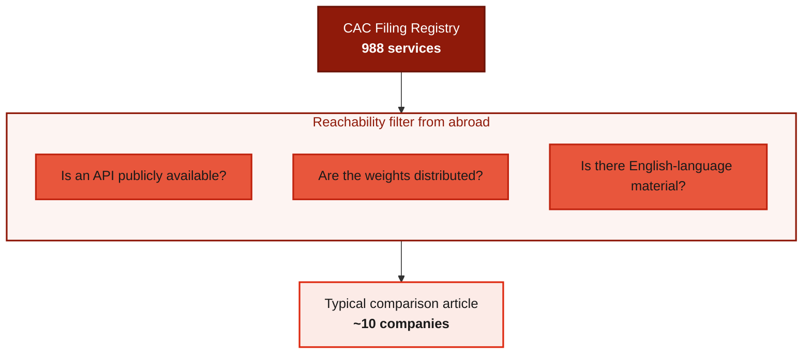
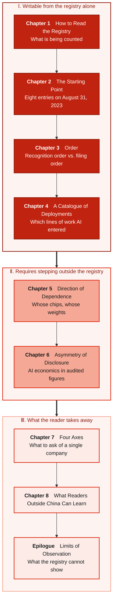
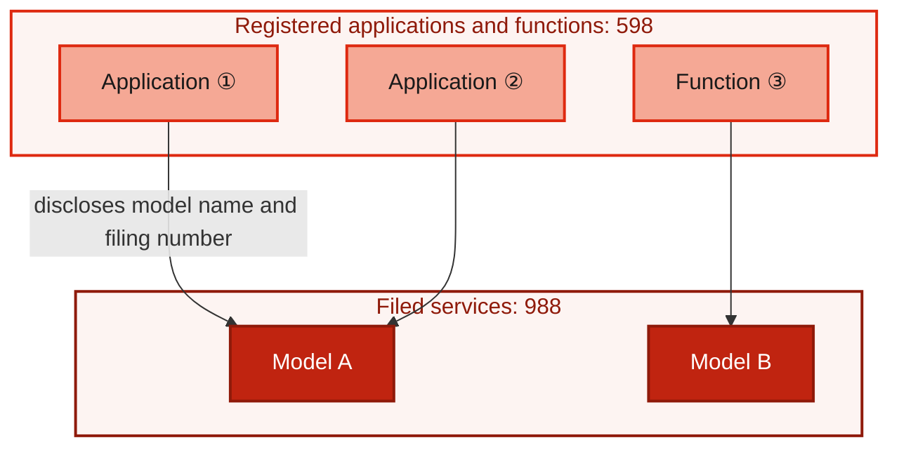
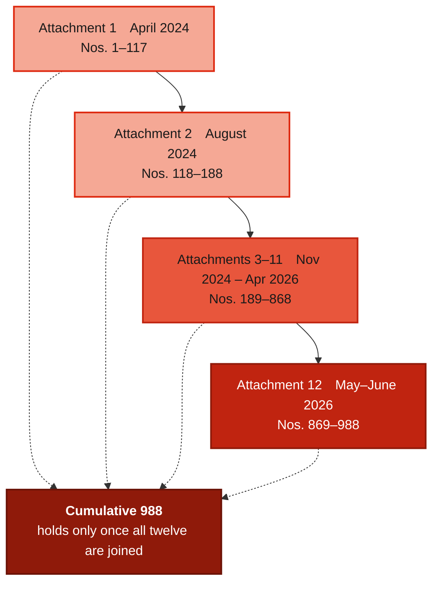
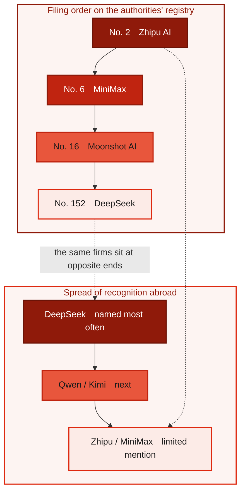
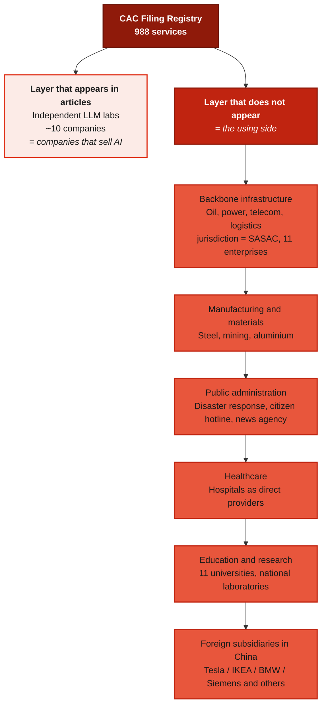
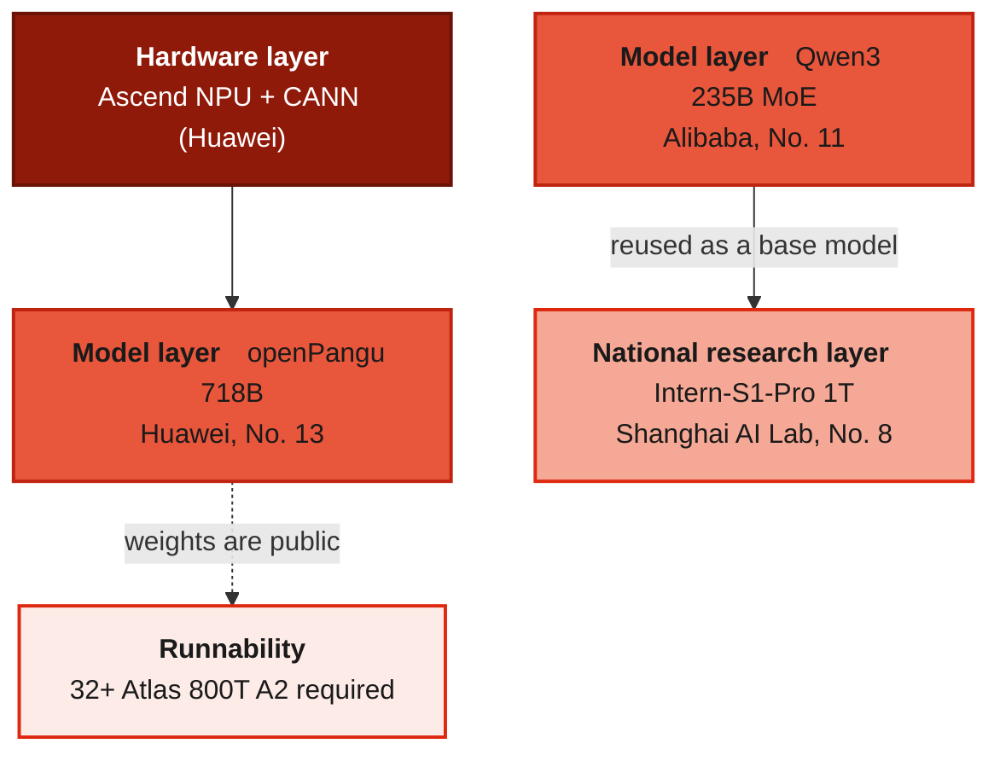
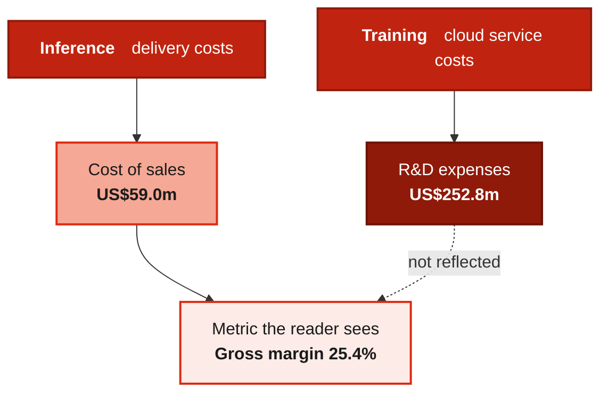
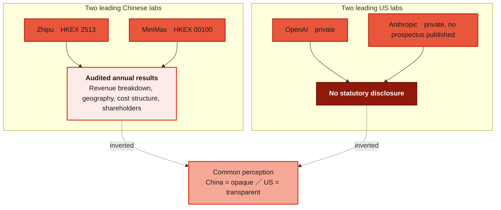
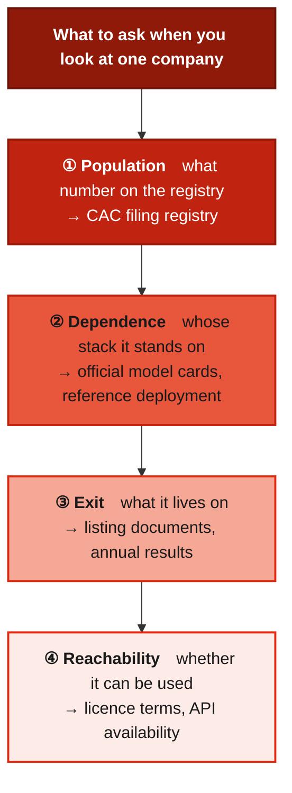

# The China AI Registry ── 988 on the List

> **"The five Chinese AI models you can name are under 1% of the ones China counts."**  
> （あなたが名前を言える5つの中国AIモデルは、中国が数えているものの1%に満たない）

 

---

# Prologue: What Fraction of China's AI Industry Are These Five?

DeepSeek. Qwen. Kimi. GLM. MiniMax.

When Chinese AI models are discussed outside China, the names that appear tend to fall within these five. 
A comparison table is built, benchmark scores and API prices lined up side by side, and the discussion ends there.

These five companies are real. The performance figures and the prices in that table are correct.

**The problem is the denominator.**

What fraction of China's AI industry do these five represent?

Neither the person who built the table nor the person who read it can answer. 
**The denominator is unknown; only the numerators are being compared.**

China is opaque, so nothing can be done — that is the usual explanation. 
But the denominator does not have to be estimated. **Chinese authorities publish it, with company names attached.**

**988.** 
The cumulative number of generative AI services that had completed *bei'an* (filing) as of June 30, 2026.

The five companies above are among those 988. **The remaining 983 are also there.**

---

## Why This Registry Exists

Providing a generative AI service in China requires filing with the authorities.

The legal basis is the *Interim Measures for the Management of Generative AI Services*（生成式人工智能服务管理暂行办法）. 
Under these measures, the Cyberspace Administration of China（国家网信办, hereafter CAC）periodically publishes the filed information.

Alongside the 988 above, there is a second figure.

**598.** 
The cumulative number of generative AI applications and functions that had completed registration.

Neither number is an estimate. Both come from a CAC notice dated July 10, 2026, whose text states that between May and June 2026, 120 services newly completed filing and 68 applications or functions newly completed registration.

On the CAC website, **twelve sets of attachments**, covering April 2024 through June 2026, are collected on a single page. Each attachment carries six columns: sequence number, jurisdiction, model name, filing entity, filing number, and filing date. 
Which company, in which province, on which date, filed a model under which name. All of it is written down.

The interval of updates is two months. 
April, August and November 2024. January, March, June, August, October and December 2025. February, April, and May–June 2026.

This registry was created for the purpose of managing expression. It is not a statistical instrument for industrial promotion. 
**Yet the result is a public record that tracks the social deployment of generative AI in full.**

For the United States, the EU and Japan, this book was unable to confirm a corresponding public record. 
Which company, in which line of business, deployed AI and when. **As a record that traces the full population at a national level, the only one this book could reach is this one.**

---

## Why Those Five

So why, out of 988, do those five appear in the articles?

**They were not selected for quality.**

**The filter is reachability.**

Can it be called from abroad through an API. Are the weights distributed. Is there material in English. 
Only what passes these three appears in comparison articles. What does not pass **disappears from the article altogether, existence and all.**

So those five are not "the representative Chinese AI models." 
**They are the Chinese AI models observable from abroad.** Not a selection, but the output of a filter.

---

## What Lies on the Side That Did Not Pass the Filter

So what is in the 983 that disappeared?

**Converter control in a steel mill.** Hebei Yongyang Special Steel（河北永洋特鋼集団）has filed a "converter intelligent steelmaking model." 
**Safety management in mining.** Cixian Xinsheng Coal Chemical has filed a "safety production control model." 
**A water utility's call centre.** Beijing Waterworks Group（北京市自来水集団）has filed "Jingshui Customer Service." 
**A municipal hotline.** The Beijing Citizen Hotline Service Center has filed the "12345 agent." 
**Pressure-ulcer management support.** Jiangsu Province Hospital（江蘇省人民医院）has filed "PressGuard." 
**Disaster response.** The Big Data Center of the Ministry of Emergency Management（応急管理部）has filed two: "Jiu'an-Zhiyan" and "Jiu'an-Zhitu."

Oil. Gas pipelines. Electric power. Aviation. Logistics. Aluminium. 
**The backbone enterprises of national infrastructure have filed their own large models.**

Foreign companies are on the same list. 
**Tesla Shanghai**（No. 843）. **IKEA China**（No. 825）. **Siemens China**（No. 674）. **Coca-Cola Shanghai**（No. 877）. **BMW China**（No. 912）. **ASUS Shanghai**（No. 823）.

Not one of these is offered abroad as an API. The weights are not distributed. There is no English documentation. 
**Because they are not being sold outside the organisation.**

Their absence from the comparison table is only natural. **There is no way for them to be objects of comparison.**

And at the same time, these are **the most concrete record available of which lines of work generative AI has actually entered.**

Not a conversational assistant, and not internal document search. 
**Processes and public services themselves.**

---

## What This Book Delivers

Place the denominator on the registry, and things invisible from the numerator side begin to appear.

This book does not compare Chinese AI models. It does not rank them. It does not recommend which to use. It does not forecast.

It does one thing. 
**Using the authorities' registry as its population, it describes the shape of this industry.**

There are three things a reader can take away.

**First, deployment cases in your own sector.** 
Chapter 4 organises the 988 by industry. **You can look up, at the level of company name and model name, which lines of work generative AI has actually entered in your own field.**

**Second, precedents for the practicalities of entering the Chinese market.** 
How Tesla, IKEA, Siemens, BMW, Coca-Cola and ASUS have filed. Chapter 8 covers this. For companies with China operations, it is directly the answer to a research question.

**Third, a teaching case for reading the economics of an AI business in real figures.** 
Chapter 6 reads the audited annual results of listed AI labs. Revenue growth, gross margin, and **where the cost of compute is recorded in the accounts.** The same cannot be confirmed for OpenAI or Anthropic. Both are private.

And one method underpins all of this.

**This industry is not counted by companies. It is counted by a registry.**

Placing the population on the registry settles several things automatically.

First, **who is in and who is out ceases to be the author's judgement.** It is decided by whether a name appears on the list.

Second, **the basis of classification sits on the authorities' side.** As described later, CAC filing numbers carry a prefix that identifies central state-owned enterprises. The author does not need to decide how to define a state-owned enterprise.

Third, **the update cycle ceases to be the author's convenience.** The registry is updated every two months. This book synchronises with that cycle.

And finally, **the limits also become the registry's limits.** The registry says nothing beyond "this was filed." Actual user numbers, revenue, technical performance — none of it is there. The boundary between what the registry can and cannot show coincides exactly with the boundary of this book.

---

## The Layers This Book Covers, and the Ones It Does Not

The layers not covered are also stated explicitly.

Comparison of the technical performance of individual models. 
Verification of benchmark scores claimed by each company. 
The chips used for training, for most companies. 
The sales model and deployment scale of the compute platforms behind iFlytek's "Spark" and SenseTime's "SenseCore." 
Independent measurement of Japanese-language performance for each model.

All of these bear on the subject. But **the primary sources could not be reached.** 
Either no public data exists with all three of measurer, measurement date and version, or the companies have not disclosed it.

What could not be reached is not written as though it had been. 
What this book does not do is stated at the outset.

---

## On the Handling of Sources

This book cites Chinese government notices and Hong Kong Stock Exchange filings at the same depth. 
**Neither, however, is treated as neutral description.**

A CAC notice is a statement of how the Chinese side has decided to manage its own generative AI services. 
A listed company's annual results are a statement of how the company explains its own performance. Having been audited makes them more reliable, but they remain the company's own words.

This book places the two side by side, with their nature made explicit.

Where a statement rests on news reporting, that is stated. 
Figures whose primary sources could not be reached are not recorded.

In preparing this book, three research engines were run in parallel. **One of them declared certain sources unreachable and then asserted their contents in its output anyway, citing a video description field and a third-party unofficial repository.** All such passages have been excluded. Details are given in the Epilogue.

The author has no commercial relationship with any Chinese government agency, AI company, or semiconductor firm, and receives no funding from any of them. 
**This book has no position to protect.**

 

---

### References

1. Cyberspace Administration of China, "Notice on the Publication of Filed Information for Generative AI Services (May–June 2026)" (July 10, 2026) — source for the cumulative 988 and 598, and for the 120 and 68 newly filed in the period 
   <https://www.cac.gov.cn/2026-07/10/c_1785427810632554.htm>
2. Cyberspace Administration of China, "Notice on the Publication of Filed Information for Generative AI Services" (April 2, 2024; hub page for Attachments 1–12) — source for the twelve intervals and the location of the company-level lists 
   <https://www.cac.gov.cn/2024-04/02/c_1713729983803145.htm>
3. *Interim Measures for the Management of Generative AI Services*（生成式人工智能服务管理暂行办法）— the legal basis of the filing regime, cited in the body of the notices above
4. Cyberspace Administration of China, Attachment 12, "Filed and Registered Information for Generative AI Services (May–June 2026)" — source for the cases listed in this Prologue (No. 908 Jingshui Customer Service, No. 877 Happy Buddy, No. 912 BMW-AI, No. 979 converter intelligent steelmaking model, No. 980 Lao-language foundation model, Registration No. 539 the 12345 agent, Registration No. 569 PressGuard, Registration No. 584 Xinhua Yudian)

 

---

# Chapter 1: How to Read the Registry ── What the Authorities Are Counting

Before the figure 988 can be used, what kind of figure it is must be settled. 
Leave that vague and every comparison downstream loses its meaning.

## The Object Is Services With "Public-Opinion Attributes or Social Mobilisation Capability"

The body of the CAC notice defines the object of filing as follows.

> 提供具有舆论属性或者社会动员能力的生成式人工智能服务的，可通过属地网信部门履行备案程序

**"Those who provide generative AI services with public-opinion attributes or social mobilisation capability may complete filing procedures through the cyberspace administration department of their jurisdiction."** That is the condition.

So 988 is not "every AI model that exists in China." 
**It is the full population of services that the authorities have judged capable of influencing public opinion or mobilising society.**

This definition is often overlooked. For this book, however, it is convenient rather than awkward. 
Because **a criterion of "what the authorities have recognised as socially influential" contains none of the author's own judgement.**

## 988 and 598 Cannot Be Added

Two figures appear in the notice.

- Filed（已备案）**generative AI services**: 988
- Registered（已登记）**generative AI applications or functions**: 598

The former are services, the latter applications or functions. 
Their sequence numbers run in separate series, and within a single PDF, filings run from No. 869 to No. 988 while registrations run from No. 531 to No. 598 — **two independent tracks side by side.**

So the statement "China has 1,586 AI models" does not hold. 
The things being counted are different.

There is also an institutional relationship between the two. The second paragraph of the notice states:

> 已上线的生成式人工智能应用或功能，应在显著位置或产品详情页面公示所使用已备案生成式人工智能服务情况，注明模型名称及备案号

**Applications or functions already online must disclose, in a prominent position or on the product detail page, the filed generative AI service they use, stating the model name and filing number.**

So the 598 registered applications each use one of the 988 filed services, and bear an obligation to display it. 
**These are two lists in a hierarchical relationship.** Which is precisely why they cannot be added.

Multiple registered applications sit on top of a single filed service. 
**A referencing relationship, not an additive one.**

## The Attachments Are Deltas, Not Cumulative Lists

The CAC hub page lists Attachments 1 through 12. 
At first glance it looks as though opening Attachment 12 would show all 988.

It does not.

Attachment 12 (May–June 2026) contains **only 120 filings, Nos. 869–988, and only 68 registrations, Nos. 531–598.** 
This matches exactly the notice's statement that 120 were newly filed and 68 newly registered.

**Each attachment records only the new entries for its period. It is a delta list.**

**Open any single one of them and 988 will not be there.**

To obtain the full 988, Attachments 1 through 12 must all be joined. 
This book did so. The result confirms that **filings connect without gaps from No. 1 to No. 988, and registrations from No. 1 to No. 598.**

This structure has a secondary effect. 
Twelve delta lists stacked at two-month intervals mean **who filed when can be traced chronologically.** A single cumulative list would have destroyed that information.

One further note: Attachment 1 (April 2024) carries a different title. 
The other eleven are titled "Filed **and Registered** Information for Generative AI Services," whereas Attachment 1 is titled only "Filed Information for Generative AI Services." 
**The registration list does not exist in Attachment 1; it begins at No. 1 in Attachment 2 (August 2024).** The application-registration regime began later than service filing.

## Comprehensive, but Not Machine-Readable

Having set out the registry's usefulness, its limits are recorded here as well.

**First, in places the sequence numbers are not in ascending order.**

In Attachment 1, No. 107 is followed by No. 110, then 108, 111, 109, 112. 
These are not gaps. The rows are arranged by filing date (March 11 → March 18 → March 14 → March 18 → March 20), and **prioritising date order has put the sequence numbers out of sequence.**

**Second, there are column shifts in the official PDF.**

In Nos. 340–345 of the March 2025 attachment, the contents of column 3 (model name) and column 4 (filing entity) are swapped. Column 3 holds a company name, "SenseTime Shenzhen"（深圳市商汤科技有限公司）, and column 4 holds a model name, "SenseTime AI code generation model"（商汤AI代码生成模型）. 
This book does not correct it and **retains the original column positions.** Correction is interpretation, not transcription.

**Third, there is stray text.**

In No. 414 of the June 2025 attachment, the filing entity reads "**司**珠海读书郎软件科技有限公司（Zhuhai Readboy Software）." The leading 司 is not deleted or corrected.

These three may look trivial. But **so long as the registry is used as a statistical population, the fact that being an official document and being machine-readable are different things must be disclosed in advance.**

## What the Registry Cannot Count

**The relation between companies and models is one-to-many.**

ModelBest（北京面壁智能科技 / ModelBest）has four filings: No. 20 "MianbiLuka LUCA," No. 625 "MiniCPM-V," No. 673 "MiniCPM-O," and No. 685 "Fazhi Fuyi." 
Shanghai Hanshu Technology（上海汉枢科技, of the Meituan group）has five: "LongCatdp," "LongCatVL," "LongCatS," "LongCatT2I," "LongCatT2V."

**So 988 does not mean 988 companies.**

There is a further complication. 
Xiaomi（小米科技有限責任公司）has three filings, while "Meizhuo Software Design (Beijing)"（美卓軟件設計（北京）有限公司）has two — "Xiaomi on-device text" and "Xiaomi Pengpai imaging." 
**The same brand is filed under a different legal entity as well.** String matching on company names cannot capture the group's real count.

Aggregating by company requires entity reconciliation. 
And the CAC table **has no column for reconciling legal entities.**

### References

1. Cyberspace Administration of China, "Notice on the Publication of Filed Information for Generative AI Services" (April 2, 2024; hub page for Attachments 1–12) 
   <https://www.cac.gov.cn/2024-04/02/c_1713729983803145.htm>
2. Cyberspace Administration of China, "Filed and Registered Information for Generative AI Services (May–June 2026)" notice (July 10, 2026) 
   <https://www.cac.gov.cn/2026-07/10/c_1785427810632554.htm>
3. Cyberspace Administration of China, "Filed and Registered Information for Generative AI Services (March–April 2026)" notice (May 13, 2026) 
   <https://www.cac.gov.cn/2026-05/13/c_1780413225190669.htm>

 

---

# Chapter 2: The Starting Point ── Eight Entries on August 31, 2023

When China's AI industry began depends on whom you ask. 
**But when filing began is fixed to a single date.**

## Eight Entries, on the Same Day

The first eight rows of Attachment 1 all carry a filing date of August 31, 2023.

| No. | Jurisdiction | Model name | Filing entity |
| --- | --- | --- | --- |
| 1 | Beijing | 文心一言 (ERNIE Bot) | 北京百度网讯科技有限公司 (Baidu) |
| 2 | Beijing | 智谱清言 (ChatGLM) | 北京智谱华章科技有限公司 (Zhipu AI / Z.ai) |
| 3 | Beijing | 云雀大模型 (Skylark) | 北京抖音信息服务有限公司 (Douyin / ByteDance) |
| 4 | Beijing | 百应 (Baiying) | 北京百川智能科技有限公司 (Baichuan AI) |
| 5 | Beijing | 紫东太初大模型开放平台 (Zidong Taichu) | 中国科学院自动化研究所 (Institute of Automation, CAS) |
| 6 | Shanghai | abab | 上海稀宇科技有限公司 (MiniMax) |
| 7 | Shanghai | 日日新 (SenseNova) | 上海商汤智能科技有限公司 (SenseTime) |
| 8 | Shanghai | 书生·浦语 (InternLM) | 上海人工智能创新中心 (Shanghai AI Laboratory) |

Five in Beijing, three in Shanghai. 
Baidu, Zhipu, ByteDance (Douyin), Baichuan, the Institute of Automation of the Chinese Academy of Sciences, MiniMax (Xiyu), SenseTime, and Shanghai AI Lab.

**A national research institute is in from day one.**

No. 5, the Institute of Automation, is a directly affiliated institute of the Chinese Academy of Sciences; No. 8, Shanghai Artificial Intelligence Laboratory, is a research institution operated through the Shanghai Artificial Intelligence Innovation Center. 
It is not that eight private firms filed first and state institutions caught up later. **They appear on the same day, on the same list, side by side.**

## The Order of What Followed

Filings continued in the following order.

| No. | Model name | Filing entity | Filing date |
| --- | --- | --- | --- |
| 9 | 星火认知大模型 (Spark) | 科大讯飞股份有限公司 (iFlytek) | 2023/9/4 |
| 10 | 360智脑大模型 (360 Zhinao) | 三六零科技集团有限公司 (Qihoo 360) | 2023/9/11 |
| 11 | 通义千问大模型 (Qwen / Tongyi Qianwen) | 阿里巴巴达摩院 (Alibaba DAMO Academy) | 2023/9/12 |
| 12 | 腾讯混元助手大模型 (Tencent Hunyuan) | 深圳市腾讯计算机系统有限公司 (Tencent) | 2023/9/14 |
| 13 | 华为云盘古NLP大模型 (Huawei Cloud Pangu NLP) | 华为云计算技术有限公司 (Huawei Cloud) | 2023/9/19 |
| 14 | 智慧助手（小艺 / Celia） | 华为软件技术有限公司 (Huawei Software) | 2023/9/27 |
| 16 | Moonshot (Kimi) | 北京月之暗面科技有限公司 (Moonshot AI) | 2023/11/3 |
| 20 | 面壁露卡 LUCA | 北京面壁智能科技有限责任公司 (ModelBest) | 2023/11/3 |
| 21 | 美团大模型「通慧」(Meituan Tonghui) | 北京三快科技有限公司 (Meituan) | 2023/11/3 |
| 35 | 阶跃 (Step) | 上海阶跃星辰智能科技有限公司 (StepFun) | 2023/11/24 |
| 67 | 零一万物大模型 (Yi) | 北京零一万物科技有限公司 (01.AI) | 2024/1/17 |

One detail concerning Huawei. 
No. 13, "Huawei Cloud Pangu NLP," is filed by Huawei Cloud Computing Technologies with **Guizhou** as its jurisdiction. No. 14, "Celia," is filed by Huawei Software Technologies with **Jiangsu** as its jurisdiction. 
Two models from the same group, filed under different legal entities, from different provinces. The entity-reconciliation problem described in Chapter 1 is present from the registry's earliest period.

## Central State-Owned Enterprises From February 2024

At No. 87, a jurisdiction unlike any before it appears.

| No. | Jurisdiction | Model name | Filing entity | Filing number | Filing date |
| --- | --- | --- | --- | --- | --- |
| 87 | **国资委** | 九天自然语言交互大模型 (Jiutian) | 中国移动通信有限公司 (China Mobile) | **ZhongYangQiYe**-JiuTian-20240123 | 2024/2/7 |

The jurisdiction column holds neither a province nor a municipality. **国资委** — the State-owned Assets Supervision and Administration Commission (SASAC). 
And the filing number carries the prefix `ZhongYangQiYe-` (central enterprise).

Central state-owned enterprises are filed by jurisdiction of supervision, not by geography. 
This numbering rule is treated in detail in Chapter 4. What should be recorded here is that **the rule exists from the early period of the regime and is consistent throughout.**

### References

1. Cyberspace Administration of China, Attachment 1, "Filed Information for Generative AI Services (April 2024)" 
   <https://www.cac.gov.cn/2024-04/02/c_1713729983803145.htm>
2. Cyberspace Administration of China, Attachment 2, "Filed and Registered Information for Generative AI Services (August 2024)" 
   <https://www.cac.gov.cn/2024-04/02/c_1713729983803145.htm>

 

---

# Chapter 3: Recognition Order and Filing Order Do Not Coincide

Take the table from the previous chapter and sort it differently.

## No. 2 and No. 152

| Company | Model | No. | Filing date |
| --- | --- | --- | --- |
| Zhipu AI / Z.ai（智譜） | 智谱清言 (ChatGLM) | **2** | 2023/8/31 |
| MiniMax | abab | **6** | 2023/8/31 |
| Shanghai AI Laboratory | 书生·浦语 (InternLM) | **8** | 2023/8/31 |
| Alibaba（阿里） | 通义千问 (Qwen) | 11 | 2023/9/12 |
| Huawei（華為） | 华为云盘古NLP (Pangu NLP) | 13 | 2023/9/19 |
| Moonshot AI（月之暗面） | Moonshot (Kimi) | 16 | 2023/11/3 |
| ModelBest（面壁智能） | 面壁露卡 LUCA | 20 | 2023/11/3 |
| StepFun（阶跃星辰） | 阶跃 (Step) | 35 | 2023/11/24 |
| 01.AI（零一万物） | 零一万物大模型 (Yi) | 67 | 2024/1/17 |
| **DeepSeek（深度求索）** | **求索对话DeepSeek Chat** | **152** | **2024/5/13** |

DeepSeek's filing number is `Beijing-DeepseekChat-202404280016`. The filing entity is 北京深度求索人工智能基础技术研究有限公司 (DeepSeek).

**No. 152.**

The company that drew global attention in early 2025, and whose name comes up most often outside China as the face of Chinese AI, is the 152nd entry on the authorities' registry. 
That is 76 times later than Zhipu, and 9.5 times later than Moonshot.

This is not a statement that DeepSeek is inferior. 
**It is the fact that the order in which the world discovered this industry and the order in which the industry was filed at home do not coincide.**

**The same two companies are placed at opposite ends of two orderings.**

## What the "Six Little Dragons" Actually Captures

Chinese AI startups are sometimes referred to collectively as the "six little dragons of large models"（大模型六小龍）. 
The membership varies by commentator, but Moonshot AI（月之暗面）, Zhipu AI（智譜）, MiniMax, Baichuan AI（百川）, 01.AI（零一万物）and StepFun（阶跃星辰）are the names most often given.

Apply the sequence numbers.

| Company | No. |
| --- | --- |
| Zhipu AI（智譜） | 2 |
| MiniMax | 6 |
| Baichuan AI（百川） | 4 |
| Moonshot AI（月之暗面） | 16 |
| StepFun（阶跃星辰） | 35 |
| 01.AI（零一万物） | 67 |

**All six fall within the first 100.**

What the label points to is not the six most capable companies. 
**It is the group that completed filing in the earliest period of the regime.** On the registry, at least, that is how it looks.

And DeepSeek is filed after every one of those six.

## What Produced This Order

The order of filing is not determined by model performance. 
Three things can be read from the registry.

**First, procedure runs through the cyberspace administration department of the jurisdiction.** As the notice states, filing goes via the local department. Processing speed may differ by region.

**Second, the timing at which the object criterion was met.** Because the object is providers of services with "public-opinion attributes or social mobilisation capability," the timing of public release governs the timing of filing.

**Third, the date the company was founded.** DeepSeek（深度求索）was founded in 2023. Many of the companies at Nos. 1–8 had businesses well before that.

Nothing beyond this can be drawn from the registry. 
**Why DeepSeek was 152nd cannot be answered from this book's sources.** What can be answered is that it was 152nd.

### References

1. Cyberspace Administration of China, Attachment 1, "Filed Information for Generative AI Services (April 2024)" — source for Nos. 2, 6, 8, 11, 13, 16, 20, 35 and 67 
   <https://www.cac.gov.cn/2024-04/02/c_1713729983803145.htm>
2. Cyberspace Administration of China, Attachment 2, "Filed and Registered Information for Generative AI Services (August 2024)" — source for No. 152 (求索对话DeepSeek Chat; filing number Beijing-DeepseekChat-202404280016; filing date 2024/5/13) 
   <https://www.cac.gov.cn/2024-04/02/c_1713729983803145.htm>
3. Cyberspace Administration of China, "Notice on the Publication of Filed Information for Generative AI Services" (April 2, 2024) — the notice text underpinning this chapter's statement that filing proceeds through the jurisdiction's cyberspace administration department 
   <https://www.cac.gov.cn/2024-04/02/c_1713729983803145.htm>

**Note**: For the label "six little dragons of large models" itself, no primary source establishing its origin could be reached. This chapter treats only the existence of the label and the sequence numbers of the companies counted under it, and does not discuss its provenance.

 

---

# Chapter 4: A Catalogue of Deployments ── Which Lines of Work AI Entered

The preceding chapters covered how to read the registry and the order in which entries appear. 
**This chapter reads the registry by industry.**

The ten or so companies that appear in articles outside China are all "companies that sell AI." 
The remainder of the 988 contains **a great many organisations on the using side.** Those speak more directly to the state of deployment.

---

## The Jurisdiction "国资委" ── The Basis of Classification Sits on the Authorities' Side

First, one classification instrument.

The jurisdiction column of the filing registry lists provinces, autonomous regions and municipalities. Beijing, Guangdong, Shanghai, Jiangsu, Zhejiang. 
Among them sits one entry that is not geographic.

**国资委** — the State-owned Assets Supervision and Administration Commission of the State Council (SASAC).

Rows carrying this jurisdiction have filing numbers that begin, without exception, with `ZhongYangQiYe-` (central enterprise). 
**Central state-owned enterprises are filed by supervisory jurisdiction, not by location.**

This gives the criterion an important property. 
The author does not have to judge whether a given company is state-owned. **The authorities' numbering rule has already decided.**

---

## Backbone Infrastructure ── Eleven Central State-Owned Enterprises

Across the full period, twelve entries carry the jurisdiction 国资委, filed by eleven distinct enterprises.

| No. | Model name | Filing entity | Filing date |
| --- | --- | --- | --- |
| 87 | 九天自然语言交互大模型 (Jiutian) | 中国移动通信有限公司 (China Mobile) | 2024/2/7 |
| 124 | 联通元景大模型 (Yuanjing) | 中国联合网络通信集团有限公司 (China Unicom) | 2024/4/24 |
| 168 | 航旅纵横千穰大模型 (Qianrang) | 中航信移动科技有限公司 (TravelSky Mobile) | 2024/7/12 |
| 199 | 昆仑大模型 (Kunlun) | **中国石油天然气集团有限公司 (CNPC)** | 2024/8/23 |
| 237 | 管网 (PipeChina LM) | **国家石油天然气管网集团有限公司 (PipeChina)** | 2024/10/23 |
| 247 | 光明大模型 (Guangming) | **中国电力科学研究院 (China Electric Power Research Institute)** | 2024/11/8 |
| 254 | 九天多模态 (Jiutian Multimodal) | 中国移动通信有限公司 (China Mobile) | 2024/11/23 |
| 276 | 小可大模型 (Xiaoke) | **中国电科集团 (CETC)** | 2024/12/16 |
| 394 | 启航大模型 (Qihang) | 中国民航信息网络股份有限公司 (TravelSky) | 2025/4/29 |
| 440 | 流云大模型 (Liuyun) | **中国物流集团 (China Logistics Group)** | 2025/7/2 |
| 454 | 坤安大模型 (Kun'an) | **中铝集团 (Chinalco)** | 2025/7/10 |
| 472 | 擎源大模型 (Qingyuan) | **国家能源集团 (China Energy Investment Corp.)** | 2025/7/22 |

Oil. Gas pipelines. Electric power. Telecommunications (two). Electronics technology. Civil aviation (two). Logistics. Aluminium. Energy.

No. 276, CETC（中国电科集团 / China Electronics Technology Group Corporation）, is a central enterprise whose core business is defence electronics. 
No. 237, PipeChina（国家石油天然气管网集团）, is a state-owned pipeline operator established in 2019. 
No. 247, the China Electric Power Research Institute, is a research body under the State Grid Corporation of China（国家電網公司）.

**In Japanese terms, it would be as if JERA, NTT, JR, NYK Line and Nippon Light Metal each held their own large model and had filed it with the state.**

Not one of these eleven appears in existing articles on Chinese AI models. 
Not because the articles are inaccurate. **These models cannot be used from abroad, so they structurally cannot enter an article built on calling APIs and comparing them.**

---

## Reading by Industry ── Where Your Own Sector Sits

The following are deployment cases extracted from the registry by industry. 
**Find the row for your own sector and read it.** Note the sequence number and the primary source can be checked in the attachments.

### Manufacturing and materials

| No. | Model name | Filing entity | What it is used for |
| --- | --- | --- | --- |
| 979 | 転炉智能煉鋼大模型 | 河北永洋特鋼集団 (Hebei Yongyang Special Steel) | Converter control in steelmaking |
| 619–622 | (4 filings) | 煤炭科学研究総院有限公司 (China Coal Research Institute) | Coal mining |
| 454 | 坤安大模型 (Kun'an) | 中铝集团 (Chinalco) | Aluminium production |
| 843 | 特斯拉车机语音大模型服务 | 特斯拉（上海）有限公司 (Tesla Shanghai) | In-vehicle voice |
| 912 | BMW-AI | 宝马（中国）汽车贸易有限公司 (BMW China) | Automotive sales and service |
| 674 | 小禹 (Xiaoyu) | 西门子（中国）有限公司 (Siemens China) | Industrial equipment |

**Deployment in manufacturing is not a conversational assistant.** Converter control, mine safety management, materials production. **It is inside the process itself.**

### Energy and utilities

| No. | Model name | Filing entity |
| --- | --- | --- |
| 199 | 昆仑大模型 (Kunlun) | 中国石油天然气集团 (CNPC) |
| 237 | 管网 (PipeChina LM) | 国家石油天然气管网集团 (PipeChina) |
| 247 | 光明大模型 (Guangming) | 中国电力科学研究院 |
| 472 | 擎源大模型 (Qingyuan) | 国家能源集团 (China Energy Investment Corp.) |
| 908 | 京水客服 | 北京市自来水集団 (Beijing Waterworks Group) |

**A water utility has put AI into its call centre and filed it with the authorities.** Few utilities elsewhere have published a comparable deployment.

### Healthcare

| Reg. No. | Model name | Filing entity |
| --- | --- | --- |
| 569 | 舒圧伴 (PressGuard) | 江蘇省人民医院 (Jiangsu Province Hospital) |
| 570 | 鼓管佳 | 南京鼓楼医院 (Nanjing Drum Tower Hospital) |
| 552 | 隴上小郎中 | 甘粛省中医院 (Gansu Provincial Hospital of TCM) |
| 496 | (1 filing) | 上海交通大学医学院附属瑞金医院 (Ruijin Hospital) |
| 353, 354 | (2 filings) | 上海市第一婦嬰保健院 (Shanghai First Maternity and Infant Hospital) |

**The hospitals themselves are the filing entities.** A vendor is not filing on their behalf; the medical institutions register as service providers in their own right. Pressure-ulcer management (PressGuard) stands out for how specific it is.

### Public administration

| No. | Model name | Filing entity |
| --- | --- | --- |
| 665, 666 | 久安-知言／久安-知図 | 応急管理部大数据中心 (Ministry of Emergency Management, Big Data Center) |
| 684 | 工会智脑 | 中華全国総工会信息中心 (All-China Federation of Trade Unions) |
| Reg. 539 | 12345智能体 | 北京市市民熱線服務中心 (Beijing Citizen Hotline Service Center) |
| Reg. 584 | 新華語典 | 新華通訊社 (Xinhua News Agency) |
| Reg. 538 | 小科热线 | 科技日報社 (Science and Technology Daily) |
| Reg. 322 | 初芯智能体平台 | 人民網股份有限公司 (People's Daily Online) |

**Disaster response, a trade-union federation, a municipal hotline, a news agency.** Government and public bodies appear on the registry as direct providers.

### Transport and logistics

| No. | Model name | Filing entity |
| --- | --- | --- |
| 168 | 航旅纵横千穰大模型 (Qianrang) | 中航信移动科技 (TravelSky Mobile) |
| 394 | 启航大模型 (Qihang) | 中国民航信息网络 (TravelSky) |
| 440 | 流云大模型 (Liuyun) | 中国物流集团 (China Logistics Group) |

### Education and research

Universities are direct filing entities.

Tongji University（同済大学・No. 897）, Xi'an Jiaotong University（西安交通大学・No. 768）, China Agricultural University（中国農業大学・No. 617「神農」）, Tibet University（西藏大学・No. 840）, Zhejiang Gongshang University（浙江工商大学・No. 818）, Shandong University of Finance and Economics（山東財経大学・No. 779）, Southwestern University of Finance and Economics（西南財経大学・No. 923「経綸」）, Beijing University of Chinese Medicine（北京中医薬大学・No. 844）, Qinghai Normal University（青海師範大学・No. 775）, Harbin Institute of Technology（哈爾濱工業大学・Reg. No. 310）, Guangdong University of Foreign Studies（広東外語外貿大学・Reg. No. 393）.

National research institutions likewise.

- Qiyuan Lab（啓元実験室）(No. 667「九格」)
- Zhejiang Lab（之江実験室）(No. 885「021科学基础模型」)
- Baima Lake Laboratory（浙江省白馬湖実験室）(No. 695「MatInsight」)
- Shanghai Innovation Institute（上海創智学院）(No. 785「启创·InnoSpark」, No. 786「Nex」)
- Institute of Software, CAS（中国科学院軟件研究所）(No. 618「朱雀」)
- China Academy of Aerospace Science and Innovation（中国航天科技創新研究院）(Nos. 749–751「天玄」, three filings)
- Beijing Academy of Artificial Intelligence, BAAI（北京智源人工智能研究院）(No. 745「可乐」)
- Beijing Humanoid Robot Innovation Center（北京人形機器人創新中心）(No. 953「天鹕」, No. 954「我悟」)

---

## The Layer That Appears in Articles, and the Layer That Does Not

Placed on a single sheet, it looks like this.

**The pale box is the entirety of what is called "Chinese AI models" outside China.**

---

## What Big Tech Has Filed Most Recently

One further pattern can be read from the registry.

| No. | Model name | Filing entity |
| --- | --- | --- |
| 623 | 百度蒸汽机 (Baidu Steam Engine) | 北京百度网讯科技有限公司 (Baidu) |
| 831 | 豆包语音 (Doubao Voice) | 北京字跳网络技术有限公司 (ByteDance) |
| 672 | Youtu-llm | 腾讯云计算（北京）有限责任公司 (Tencent Cloud) |
| 763 | Xiaomi MiMo | 小米科技有限责任公司 (Xiaomi) |
| 641 | 天问 (Tianwen) | 上海依图网络科技有限公司 (Yitu Technology) |
| 624 | 360安全 (360 Security) | 三六零数字安全科技集团有限公司 (Qihoo 360) |
| 625 | MiniCPM-V | 北京面壁智能科技有限责任公司 (ModelBest) |
| 673 | MiniCPM-O | 北京面壁智能科技有限责任公司 (ModelBest) |

None of these is a general-purpose flagship model. 
Voice, security, multimodal, on-device. **They are vertically specialised or modality-specific products.**

The general-purpose models were filed early; what has been added since accumulates by use case. 
**A "new filing" on the registry more often means an existing company extending its use cases than a new company entering.**

This carries an implication for AI adoption planning elsewhere as well. **Selecting one foundation model and being done with it is not what the leading market actually looks like; deployments accumulate use case by use case.**

---

## Distribution by Jurisdiction

For the 423 entries numbered 189–611, the counts by jurisdiction are as follows.

| Jurisdiction | Count |
| --- | --- |
| Beijing | 81 |
| Guangdong | 80 |
| Shanghai | 72 |
| Jiangsu | 43 |
| Zhejiang | 40 |
| Shandong | 25 |
| Sichuan | 12 |
| Hebei | 11 |
| **SASAC (国资委)** | **9** |
| Hubei | 7 |
| Anhui / Hunan / Fujian | 5 each |
| Yunnan | 4 |
| Tianjin / Guangxi / Henan / Guizhou | 3 each |
| Shanxi / Shaanxi / Heilongjiang | 2 each |
| Jilin / Ningxia / Jiangxi / Hainan / Liaoning / Chongqing | 1 each |

**The top five jurisdictions account for 316 entries, or 74.7%.**

And SASAC ranks ninth with 9. 
A supervisory category sits in parallel with geographic ones. The rule that central enterprises do not belong to a province is visible directly in the tabulation.

### References

1. Cyberspace Administration of China, Attachments 1–12 (filing and registration lists) 
   <https://www.cac.gov.cn/2024-04/02/c_1713729983803145.htm>

 

---

# Chapter 5: The Direction of Dependence ── Chips, Weights, and the State

The registry tells you who filed. It does not tell you what they are standing on. 
This chapter treats the dependencies readable from official technical materials.

## Huawei ── Open, but Not Runnable

Huawei's openPangu-Ultra-MoE-718B-V1.1 is an MoE model with 718B total parameters and 39B active parameters. 
Official material states that it was trained on Ascend NPUs.

The weights are public. But reading the official reference deployment requirements reveals something else.

> **32 or more Atlas 800T A2 (64GB)**, CANN 8.1.RC1, torch-npu, vllm-ascend

**Thirty-two or more Ascend NPUs.**

That the weights are public and that you can run them locally are different things. 
What is published is the weights, not the compute platform needed to run them.

One correction to record. At the outset of this research the author held the hypothesis that "Pangu is inseparable from MindSpore." **That does not match the current official materials.**

The reference implementation of current openPangu is not MindSpore-only; it uses PyTorch with torch-npu. 
In the Pangu-α era the stack was MindSpore + CANN + Ascend 910 + ModelArts, but the upper framework layer has widened toward PyTorch. 
**What is tightly coupled is not the framework layer but the Ascend/CANN layer.**

## Shanghai AI Lab ── A National Institute Standing on a Company's Weights

Shanghai AI Lab's Intern-S1-Pro has 1T total parameters and 512 experts, activating 8 experts per token for roughly 22B active parameters.

The official repository documentation notes that Qwen3 235B MoE and others are used as base models.

**A national research institute's model is built on a private company's open weights.**

This shows the limit of reading the registry by dividing it into "independent labs," "big tech" and "state institutions" as separate layers. 
Shanghai AI Lab, on the registry from day one at No. 8, is using weights released by Alibaba at No. 11. 
**The layers are not separate compartments. The lower layer is the ground the upper one stands on.**

**A national research institute stands on a private company's weights.** The arrows run in one direction only.

BAAI（北京智源人工智能研究院 / Beijing Academy of Artificial Intelligence）has likewise published weights and a technical report for RoboBrain 2.5 for robotics. The same institution appears on the registry at No. 745 (可乐).

## StepFun ── Down to the OS and the Device

StepFun（上海阶跃星辰智能科技 / StepFun, No. 35）announced on July 13, 2026 the AI device brand STEPX, the agent-native OS "Step AOS," the personal agent "Amoo," and the smartphone "STEPX Neo" (Xinhua report). 
Ecosystem partners named include Trip.com（携程）, Alipay（支付宝）, DiDi（滴滴）, Meituan（美団）, WPS and CapCut（剪映）.

One distinction is required here.

**"Announced" and "shipped" are different.**

At the same event, the SoC, display specifications, battery capacity, retail price, shipping date and target shipment volume were all left undisclosed (Sina Finance report).

This book states that STEPX Neo was **announced and exhibited.** 
It does not state that it **shipped.** No primary source establishing mass-production shipment or sales has been reached.

## Training Chips Are Unknown for Most Companies

This book attempted to identify the chips each company used for training. 
**The result is recorded as unknown for most of them.**

On this point, one case is preserved here.

One of the three research engines used asserted that "DeepSeek-V4-Pro was trained on Ascend CloudMatrix384 SuperPOD and achieved 34.22% MFU." 
The source given was `arXiv:2607.20145`.

But the title of that paper is **"SLAI T-Rex: Full-Parameter Post-training of the DeepSeek-V4."**

**Post-training.** It is not a record of pre-training. 
Nor has it been confirmed that "SLAI," the entity performing the work, is DeepSeek.

The other two engines both reported DeepSeek's training chips as unknown.

**Read post-training as training in full, and an assertive sentence can be written.** It can be written, but it is not a fact. 
This book does not adopt that statement.

### References

1. InternLM official GitHub repository 
   <https://github.com/InternLM/InternLM>
2. Huawei Ascend developer site, technical article on "openPangu-Ultra-MoE-718B-V1.1" (October 15, 2025) — this book was unable to verify the reachability of the URL from its writing environment, so no link is given; refer to the corresponding article on the Ascend developer site
3. MindSpore official site, "Pangu" page — same as above
4. Beijing Academy of Artificial Intelligence (BAAI), "RoboBrain 2.5" publication page — same as above

 

---

# Chapter 6: The Asymmetry of Disclosure ── China Listed, America Not

"Chinese AI companies are opaque." That premise is widely shared.

This chapter shows that, for at least two of them, the premise is inverted.

## Two Companies Are Already Listed

In January 2026, two companies listed in succession on the Hong Kong Stock Exchange.

| Company | Ticker | Listing date |
| --- | --- | --- |
| Zhipu（智谱 / Zhipu AI・Z.ai） | 2513 | January 8, 2026 |
| MiniMax（上海稀宇科技 / MiniMax） | 00100 | January 9, 2026 |

No. 2 and No. 6. 
Two of the first eight entries on the registry became listed companies two years and four months after the regime began.

Becoming a listed company means **bearing an obligation to publish audited financial statements at regular intervals.**

## MiniMax's Fiscal 2025

MiniMax published its fiscal 2025 annual results on March 2, 2026. The auditor is Ernst & Young. 
All figures below are from that announcement.

| Item | FY2025 | FY2024 | Change |
| --- | --- | --- | --- |
| Revenue | US$79,038k | US$30,523k | +158.9% |
| Cost of sales | US$58,959k | — | — |
| Gross profit | US$20,079k | — | — |
| Gross margin | **25.4%** | 12.2% | +13.2pt |
| Loss for the year | US$1,871,617k | US$465,238k | +302.3% |
| Adjusted net loss (non-IFRS) | **US$250,856k** | US$244,243k | +2.7% |
| R&D expenses | US$252,771k | US$188,979k | +33.8% |
| Selling and distribution | US$51,896k | US$86,995k | **−40.3%** |
| Employees | **428** | — | — |

Of the US$1.87bn loss for the year, **US$1.59bn is a fair-value loss on financial liabilities.** It is a remeasurement loss arising from the increase in the valuation of preferred shares, and involves no cash outflow. 
To see the substantive loss, one must look at the adjusted net loss of US$250.9m, which is up only 2.7% year on year.

**Revenue grew 158.9% while the substantive loss grew 2.7%.**

The revenue breakdown is disclosed as well.

| Segment | Amount | Share |
| --- | --- | --- |
| AI-native products | US$53,075k | 67.2% |
| Open Platform and enterprise AI services | US$25,963k | 32.8% |

And by geography.

| Region | Amount | Share |
| --- | --- | --- |
| **Outside mainland China** | **US$57,663k** | **73.0%** |
| Mainland China | US$21,375k | 27.0% |

**73.0% of revenue comes from outside mainland China.**

Per the company's own description, it has served over 236 million users across more than 200 countries and regions, and 214,000 enterprise customers and developers across more than 100 countries and regions.

## The Cost of Compute Is Not in Cost of Sales

The most structurally significant finding in these results is what the 25.4% gross margin actually means.

On the increase in R&D expenses, the company explains: **an increase in cloud service costs relating to training.**

Line the figures up.

| Item | Amount |
| --- | --- |
| Cost of sales | US$58,959k |
| R&D expenses | US$252,771k |

**R&D expenses are 4.3 times cost of sales.**

So the largest compute spend at this company is recorded not in cost of sales but in R&D. 
**Training costs go to R&D, inference costs go to cost of sales — separated in the accounts.**

Therefore **the 25.4% gross margin is a figure that looks only at inference.** It is not the economics of the business including training.

**The dotted arrow does not arrive.** The 25.4% gross margin does not contain the spend, 4.3 times larger, recorded under R&D.

This is not improper accounting. Excluding research and development from cost of sales is standard treatment. 
But when the argument is "Chinese AI has low gross margins" or "margins are improving," which range the figure covers cannot be known without opening the financial statements.

## Zhipu Has the Opposite Structure

Multiple news outlets have reported figures for Zhipu (HKEX 2513) for fiscal 2025. 
**What follows is based on news reporting.** This book has not reached the original financial statements.

| Item | FY2025 | Change |
| --- | --- | --- |
| Revenue | RMB724.33m | +131.9% |
| Loss for the year | RMB4.72bn | +59.5% |
| Overall gross margin | 41% | 56% in 2024 |
| Cloud deployment gross margin | 19% | 3% in 2024 |
| On-premise deployment gross margin | 49% | 66% in 2024 |

One conflict between reports cannot be resolved. 
**The same figure, RMB3.18bn, is attributed by different outlets both to "R&D expenses" (+44.9%) and to "adjusted net loss" (+29.1%).** 
Some outlets list both as separate items. Which is correct cannot be determined without opening the original statements. **This book will not use either figure on its own until primary verification is complete.**

Even so, something can be said with confidence.

MiniMax draws 73.0% of revenue from outside mainland China, and 67.2% from consumer-facing AI-native products. 
Zhipu's on-premise deployment accounts for a 49% gross margin, and is reported to be centred on enterprise and government customers.

**Two companies filed on the same day, listed in the same month, hold opposite revenue structures.**

A single category called "Chinese AI labs" does not hold up against audited figures.

## And the Same Cannot Be Confirmed for the Two American Labs

Everything above is drawn from published, audited documents.

The same exercise cannot be performed for OpenAI and Anthropic.

Both are private, and bear no statutory disclosure obligation for revenue breakdown, customer concentration, cost-of-sales composition, or major shareholder structure.

For Anthropic, it was reported that a confidential IPO filing was made in the United States in early June 2026; as of the end of August 2026, no prospectus had been published. 
Reports indicate publication would come after September 7.

So at the time of writing, **no statutory disclosure at the same granularity exists.**

**The asymmetry of primary sources points in the opposite direction from the asymmetry of perception.**

**Inside the red-bordered group sits the pale box. Inside the other sits the dark one.** The shading is reversed.

The side described as opaque has been publishing audited figures for eight months. 
The side that feels transparent has not published them yet.

This is not a statement about which is better. Listing is a choice, not an obligation, and being private is in no way improper. 
This book points to one thing only: **the answer to which side is observable can run counter to intuition.**

### References

1. MiniMax (HKEX 00100), "Annual Results Announcement for the Year Ended December 31, 2025" (March 2, 2026; auditor Ernst & Young) 
   <https://www1.hkexnews.hk/listedco/listconews/sehk/2026/0302/2026030202837.pdf>
2. HKEXnews, Hong Kong Exchanges and Clearing Limited 
   <https://www.hkexnews.hk/>
3. Reuters, "Anthropic could publish IPO prospectus after September 7 — report" (August 28, 2026) ※news reporting

 

---

# Chapter 7: Four Axes for Reading This Industry

The facts assembled so far are converted here into something reusable.

What this book offers is not a ranking of models. 
**It is a procedure for what to ask when you look at a single Chinese AI company.**

## The Four Axes

| Axis | The question | Where the answer is found |
| --- | --- | --- |
| **Population** | What number is this company on the registry? How many filings does it hold? | CAC filing registry (Attachments 1–12) |
| **Dependence** | Whose chips, whose weights is it standing on? | Official model cards, reference deployment configurations |
| **Exit** | What does it intend to live on (API, devices, government procurement, listing)? | Listing documents, annual results, funding announcements |
| **Reachability** | Can it actually be used from abroad? | Licence terms, distribution record, API availability |

## What Each Axis Distinguishes

**The population axis** shows where the company sits within the regime. 
A low number means an early participant; multiple filings mean expanding use cases; a jurisdiction of 国资委 means a central state-owned enterprise. 
**This axis alone contains none of the author's judgement.** It is settled by whether a name appears on the list.

**The dependence axis** shows whether the company is autonomous. 
A company standing on Ascend and one standing on NVIDIA have opposite resilience to export controls. An institution standing on another party's open weights is exposed to that party's change of policy.

**The exit axis** shows what the company is selling. 
API billing, device integration and government procurement demand different organisations, different growth curves and different risks. As Chapter 6 showed, even two listed companies can be opposites.

**The reachability axis** shows whether it can be used from where you are. 
If the weights are public but 32 NPUs are required, it is out of reach for most readers. If it is on the registry but not offered abroad, it will not appear in articles.

## Applying the Four Axes to Three Companies

An axis is not an instrument until it is used. 
Applied to three companies of different character, here is what it distinguishes.

| | **DeepSeek** | **CETC（中国电科集团）** | **MiniMax** |
| --- | --- | --- | --- |
| **Population** | No. 152, one filing | No. 276, one filing **jurisdiction = SASAC** | No. 6, multiple filings |
| **Dependence** | Training chips unknown | No public information | Training costs recorded in R&D (disclosed) |
| **Exit** | API billing time-of-day pricing introduced | Unknown from the registry speculation avoided | Listed; 73.0% of revenue outside mainland China |
| **Reachability** | API public, weights distributed | No record of offering abroad | API public, listing disclosures available |

The three stand at different positions on every axis.

**DeepSeek has the highest reachability and the lowest disclosure.** Anyone can use it, yet neither its finances nor its training environment can be known. 
**CETC has zero reachability, and only the population axis returns an answer.** Even so, the single fact that its jurisdiction is SASAC is fixed by the authorities' numbering rule. 
**MiniMax has the highest disclosure.** Being listed, questions impossible to answer for the other two can be answered here.

What matters here is that **no ranking among the three emerges.** 
The four axes are not an instrument for ordering companies. **They are an instrument for settling, in advance, what is knowable and what is not about a single company.**

An article discussing DeepSeek's training chips is written without knowing that the dependence axis has no answer. 
An article in which CETC does not appear has not registered that its population was built on the reachability axis alone.

## Applying the Four Axes to Existing Comparison Articles

A comparison article lining up benchmarks and API prices is working **on the reachability axis alone.**

Among the models that can be reached, it compares performance and price. 
That is useful in itself, and it is information a user needs.

But **what cannot be reached cannot become an object of comparison, so its existence disappears from the article.** 
The eleven central state-owned enterprises are absent not because the article is inaccurate, but because its form structurally excludes them.

## What to Revisit at Each Update

This book is a living document. It is revised by the following procedure.

| Trigger | What to revisit | Cycle |
| --- | --- | --- |
| New CAC attachment published | Appendix lists, counts in Chapter 1, jurisdiction distribution in Chapter 4, **the absolute figures in the Prologue (988 / 983)** | **Every two months (synchronised with the authorities' publication cycle)** |
| Listed company results disclosed | Chapter 6 | Quarterly |
| New version of a major model released | Relevant sections of Chapter 5 | As needed |
| Primary verification completed | Epilogue and the relevant passage | As needed |

**This book's revision cycle follows the authorities' publication cycle, not the author's convenience.**

Note that the opening line ("under 1%") requires no update as the denominator grows. Filings are cumulative and do not decrease, so the statement can only move in the direction of becoming stronger as the denominator rises. **Precise absolute figures are carried by the body; the update-free summary is carried by the opening.**

### References

This chapter reorganises primary sources already presented in Chapters 1 through 6 and introduces no new ones. The basis for each axis corresponds as follows.

1. **Population axis** — Cyberspace Administration of China, Attachments 1–12 (filing and registration lists) <https://www.cac.gov.cn/2024-04/02/c_1713729983803145.htm> — source for DeepSeek No. 152, CETC No. 276 with jurisdiction 国资委, and MiniMax No. 6
2. **Dependence axis** — Huawei Ascend developer site, technical article on "openPangu-Ultra-MoE-718B-V1.1" (October 15, 2025) / InternLM official GitHub repository <https://github.com/InternLM/InternLM> — source for reference deployment configuration and base-model reuse
3. **Exit axis** — MiniMax (HKEX 00100), "Annual Results Announcement for the Year Ended December 31, 2025" (March 2, 2026; auditor Ernst & Young) <https://www1.hkexnews.hk/listedco/listconews/sehk/2026/0302/2026030202837.pdf> — source for the 73.0% geographic split and the recording of cloud training costs in R&D
4. **Reachability axis** — DeepSeek official API documentation (time-of-day pricing effective August 17, 2026) / official model cards and licence terms

 

---

# Chapter 8: What Readers Outside China Can Learn From This Registry

Up to this point this book has read China's registry. 
This chapter sets out **what a reader working outside China can take from it.**

---

## 1. A Primary-Source Counterweight to the "Stuck at PoC" Argument

Discussions of generative AI outside China arrive, without fail, at the same wall. 
"The PoC works but it never reaches production." "The effect was there, but not for core operations."

That discussion is missing a comparator. 
**Is it in fact reaching production elsewhere? If so, in which lines of work?**

The registry answers that question with a primary source.

As Chapter 4 showed, the 988 include converter control, mine safety management, a water utility's call centre, a municipal hotline, pressure-ulcer management and disaster response. 
**Not a conversational assistant, and not internal document search. Processes and public services themselves.**

Two points can be drawn from this.

**First, deployment is happening on the using side, not among companies that sell AI.** Most of the registry consists of operating companies, hospitals and government bodies rather than AI vendors. To the extent that AI discussion elsewhere skews toward vendor product comparison, it is looking in the wrong place.

**Second, deployment accumulates use case by use case.** Even big tech's recent filings are vertically specialised — voice, security, on-device. Rather than selecting one foundation model and rolling it out company-wide, deployments stand up individually, by use case.

There is, however, **a significant caveat.**

The registry says nothing beyond "this was filed." **How much a given service is actually used, and whether it delivers results, cannot be learned from the registry at all.** That filing does not signify successful deployment is restated in the Epilogue.

What can be said reaches only this far: a public registry exists recording that services have been provided in lines of work where comparable records do not exist elsewhere. 
**Even that alone is a sufficiently strong primary source to serve as a comparator for the "stuck at PoC" argument.**

---

## 2. Precedents for Entering the Chinese Market

For companies with China operations, the registry is a more direct resource.

**Six foreign subsidiaries have in fact filed.**

| No. | Model name | Filing entity |
| --- | --- | --- |
| 674 | 小禹 (Xiaoyu) | 西门子（中国）有限公司 (Siemens China) |
| 823 | MuseCenter | 华硕电脑（上海）有限公司 (ASUS Shanghai) |
| 825 | 宜家文本智能助手 (IKEA Text Assistant) | 宜家电子商务（中国）有限公司 (IKEA China) |
| 843 | 特斯拉车机语音大模型服务 (Tesla in-car voice LM) | 特斯拉（上海）有限公司 (Tesla Shanghai) |
| 877 | 快乐搭子 (Happy Buddy) | 可口可乐饮料（上海）有限公司 (Coca-Cola Shanghai) |
| 912 | BMW-AI | 宝马（中国）汽车贸易有限公司 (BMW China) |

Three practical facts can be read from this.

**First, the filing entity is the local subsidiary.** All six filed under a China-domiciled legal entity. Not the parent company.

**Second, the unit of filing is the service.** Not "Tesla's AI" but "特斯拉车机语音大模型服务," a specific named service. The application form specifies the use case.

**Third, there is no separate track for foreign companies.** They sit on the same registry as Chinese companies, in the same column structure, in the same running sequence.

And as Chapter 1 showed, the object of filing is services with "public-opinion attributes or social mobilisation capability." 
**Whether a function used only internally and not provided externally falls within scope cannot be determined from the registry.** What appears on the registry is only the outcome of having been judged in scope and filed.

**This section is not legal advice.** Whether filing is required in practice, and the procedure for it, must be confirmed with specialists on the basis of Chinese law and the authorities' operational practice. 
What this book provides is **the location of precedents — how peer companies and comparable foreign firms have in fact filed.**

---

## 3. Reading the Economics of an AI Business in Real Figures

The figures read in Chapter 6 have another use.

**Teaching material for the unit economics of an AI business, in audited real figures, is scarce.** Outside these two companies, this book could not reach any.

OpenAI and Anthropic are both private. There is no statutory disclosure of revenue breakdown, gross margin, or compute cost structure. 
MiniMax (HKEX 00100), by contrast, publishes audited annual results.

Of the structures readable there, the most practically important is this.

**The cost of compute is split across cost of sales and R&D expenses.**

| Item | Amount |
| --- | --- |
| Cost of sales | US$58,959k |
| R&D expenses | US$252,771k |

The company explains the increase in R&D as an increase in cloud service costs relating to training. 
**R&D is 4.3 times cost of sales.**

Therefore **the published gross margin of 25.4% looks only at inference.** It is not the economics of the business including training.

This is not improper accounting. Excluding research and development from cost of sales is standard treatment. 
**But when building a financial plan for your own AI service, benchmarking against another company's gross margin without knowing about this split will badly understate the capital required.**

There is a second lesson about business structure.

MiniMax draws 73.0% of revenue from outside mainland China, and 67.2% from consumer-facing AI-native products. 
Zhipu is centred on on-premise deployment, with a 49% gross margin there, and is reported to serve mainly enterprise and government customers.

**Two companies filed on the same day, listed in the same month, hold opposite revenue structures.**

There is no single template called "the AI company business model." 
**Growing through overseas consumers and growing through domestic enterprise demand different organisations, different uses of capital, and different risks.** Which to choose is a question of business design, not technology.

---

## 4. And There Is No Registry Elsewhere

One last observation, from writing this book.

**For countries outside China, this book was unable to confirm a corresponding record.**

Which company, in which line of business, deployed generative AI and when. 
No public mechanism for capturing this at a national level could be confirmed for Japan, the United States or the EU within the scope of this research.

China's registry was created for regulatory purposes. Its aim is the management of expression, not statistics for industrial promotion. 
**Whether one endorses that aim is a separate question entirely.**

But the result is that **China is in a position to observe its own AI deployment in full.** 
Companies elsewhere, to learn the state of deployment in their own countries, rely on surveys and case collections.

What cannot be observed cannot be improved. 
**This asymmetry is not a difference in technical capability. It is a difference in the design of record-keeping.**

 

---

### References

1. Cyberspace Administration of China, Attachments 1–12 (filing and registration lists) — source for the six foreign subsidiaries cited in this chapter (No. 674 Siemens, No. 823 ASUS, No. 825 IKEA, No. 843 Tesla, No. 877 Coca-Cola, No. 912 BMW) and for the industry cases 
   <https://www.cac.gov.cn/2024-04/02/c_1713729983803145.htm>
2. Cyberspace Administration of China, "Notice on the Publication of Filed Information for Generative AI Services" (April 2, 2024) — source for the filing criterion "具有舆论属性或者社会动员能力" 
   <https://www.cac.gov.cn/2024-04/02/c_1713729983803145.htm>
3. MiniMax (HKEX 00100), "Annual Results Announcement for the Year Ended December 31, 2025" (March 2, 2026; auditor Ernst & Young) — source for cost of sales US$58,959k, R&D expenses US$252,771k, gross margin 25.4%, and the 73.0% geographic split 
   <https://www1.hkexnews.hk/listedco/listconews/sehk/2026/0302/2026030202837.pdf>

**Note**: Section 2 of this chapter is not legal advice. Whether filing is required for a generative AI service in China, and the procedure involved, must be confirmed with specialists on the basis of Chinese law and the authorities' operational practice. What this book provides is the location of precedents only.

 

---

# Epilogue: What the Registry Cannot Show

This book placed its population on the registry. 
The cost of doing so is that what the registry does not say, this book cannot say either.

## What the Registry Does Not Say

**It does not say actual user numbers.** No. 1, ERNIE Bot, and No. 988, LeapAI, are a single row each on the registry.

**It does not say revenue.** Apart from the two listed companies, the business scale of the 988 cannot be learned from the registry at all.

**It does not say technical performance.** Neither parameter counts nor benchmarks exist among the registry's columns.

**It does not say continuity.** A filing is a record of registration; it does not guarantee that the service is still being offered. For 01.AI (No. 67), a notice has been confirmed stating that its official API would be suspended from August 25, 2026. The registry does not reflect this.

**A filing means nothing beyond "this was filed."**

Chapter 8 set out implications for readers outside China, and the same limit applies there. 
**Whether the deployments on the registry are succeeding has not been verified by this book at all.** Whether the converter-control model actually raised utilisation, whether the municipal hotline's response quality improved — the registry says nothing. 
What this book can show is only that a record exists of a service having been provided in that line of work.

## What This Book Could Not Reach

The following primary sources had not been reached at the time of writing.

1. The original financial statements of Zhipu for fiscal 2025 (Chapter 6 is written from news reporting)
2. The licence and actual weight-distribution status of GLM-5.3 (the research engines contradicted one another, and one side's source was a third-party unofficial quantised repository)
3. The training chips used by most companies
4. The sales model and deployment scale of the compute platforms behind iFlytek's "Spark" and SenseTime's "SenseCore"
5. The CAC notice of July 2025 (cumulative figures as of June 30, 2025)
6. Primary sources on Moonshot AI's valuation

## Why "World First" Is Not Written Here

In preparing this book, three research engines were asked whether a work exists that structures Layers 1 through 5 within a single framework.

The responses were as follows.

- Engine A: none found within the scope of this research; the closest is a CSIS article, but it does not dissect companies by layer
- Engine B: **a comprehensive search of CNKI and equivalents was incomplete, so a negative finding is withheld**
- Engine C: nothing confirmed on Google Scholar, CNKI or SSRN

One of the three withholds a negative finding.

Accordingly this book writes neither **"world first"** nor **"the only."** 
What can be written reaches only as far as: within the scope of this research, no work performing an equivalent synthesis could be reached.

Beyond that, three engines returning the same blank is not independent corroboration. 
**Given the same question, a flaw in the question appears identically in all three.**

## A Record of a Misreading

This book preserves one misreading that occurred during the research.

One of the research engines returned an assertive statement about DeepSeek's training chips. The source was `arXiv:2607.20145`. 
But the paper is titled "SLAI T-Rex: **Full-Parameter Post-training** of the DeepSeek-V4." **It is a paper on post-training.**

The same engine used a video description field as its source for Zhipu's listing and fundraising figures, a reseller's site as its source for API pricing, and a third-party unofficial quantised repository as its source for model configuration. 
And in its self-check section, the box for "no prohibited source types used" was ticked.

**An assertive sentence can always be written.** 
That it can be written and that it is true are different things.

This record is preserved not to demonstrate the author's integrity. 
**It is preserved because the same materials can reproduce the same error, and the next reader should be told where the error can occur.**

## What Is Being Counted

Finally, the central proposition once more.

**This industry is not counted by companies. It is counted by a registry.**

988 services. 598 applications. A notice every two months. Twelve delta lists. Sequence numbers running unbroken from 1 to 988. The prefix `ZhongYangQiYe-`. The entry 国资委 sitting in the jurisdiction column.

All of these are administrative forms. 
And China's AI industry is counted, recorded and published within those forms.

To know the shape of the industry, do not count the companies. **Open the ledger.**

The ledger is public.

 

---

### References

1. Cyberspace Administration of China, Attachments 1–12 (filing and registration lists) — every statement in the section "What the Registry Does Not Say" rests on the registry's column structure (sequence number, jurisdiction, model name, filing entity, filing number, filing date) 
   <https://www.cac.gov.cn/2024-04/02/c_1713729983803145.htm>
2. 01.AI official API documentation — source for the notice of API suspension from August 25, 2026, cited as an instance of information the registry does not reflect
3. arXiv:2607.20145, "SLAI T-Rex: Full-Parameter Post-training of the DeepSeek-V4" — the paper treated in "A Record of a Misreading." The title establishes that it concerns post-training. **This book does not use the contents of this paper as a basis for any factual claim.**
4. Center for Strategic and International Studies (CSIS), "What to Know About Chinese AI Models" (July 2, 2026) — judged in this book's gap analysis to be the closest existing work to an integrated structuring, though it is organised around four questions rather than a layer-by-layer dissection of companies

**Sources that could not be reached** (as listed in the body)

- The original fiscal 2025 financial statements of Zhipu (HKEX 2513)
- An official Z.ai announcement of the licence and actual weight distribution of GLM-5.3
- Official statements on the chips used for training at each company
- Official materials on the sales model and deployment scale of the compute platforms behind iFlytek（科大讯飞）"Spark" and SenseTime（商汤科技）"SenseCore"
- The CAC notice of July 2025 (cumulative figures as of June 30, 2025)
- Primary sources on the valuation of Moonshot AI（月之暗面）

 

---

**© 2026 Satoshi Yamauchi / Leading.AI — Licensed under CC BY 4.0**
