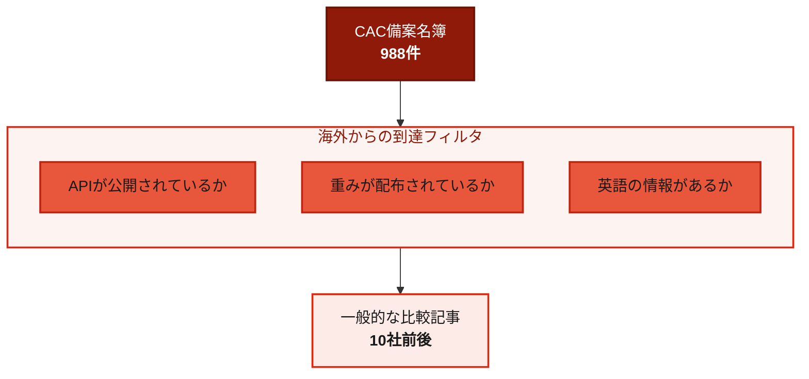
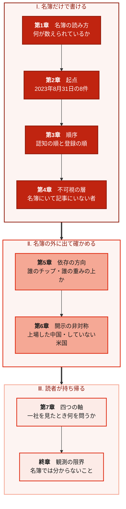
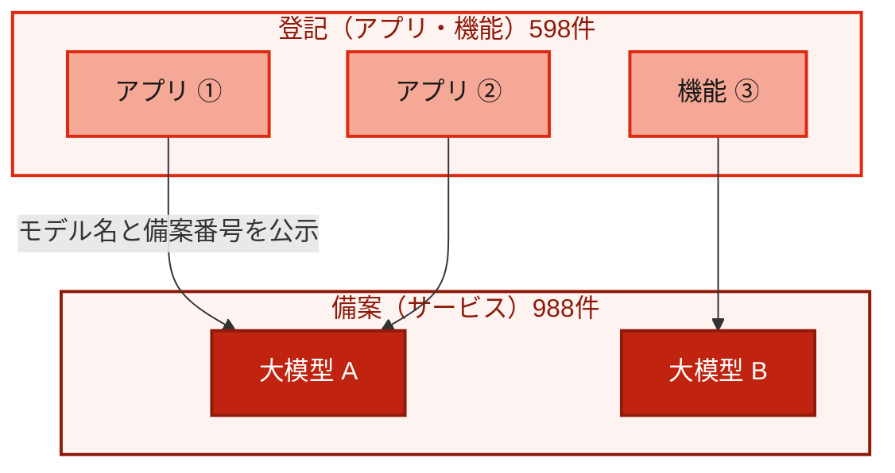
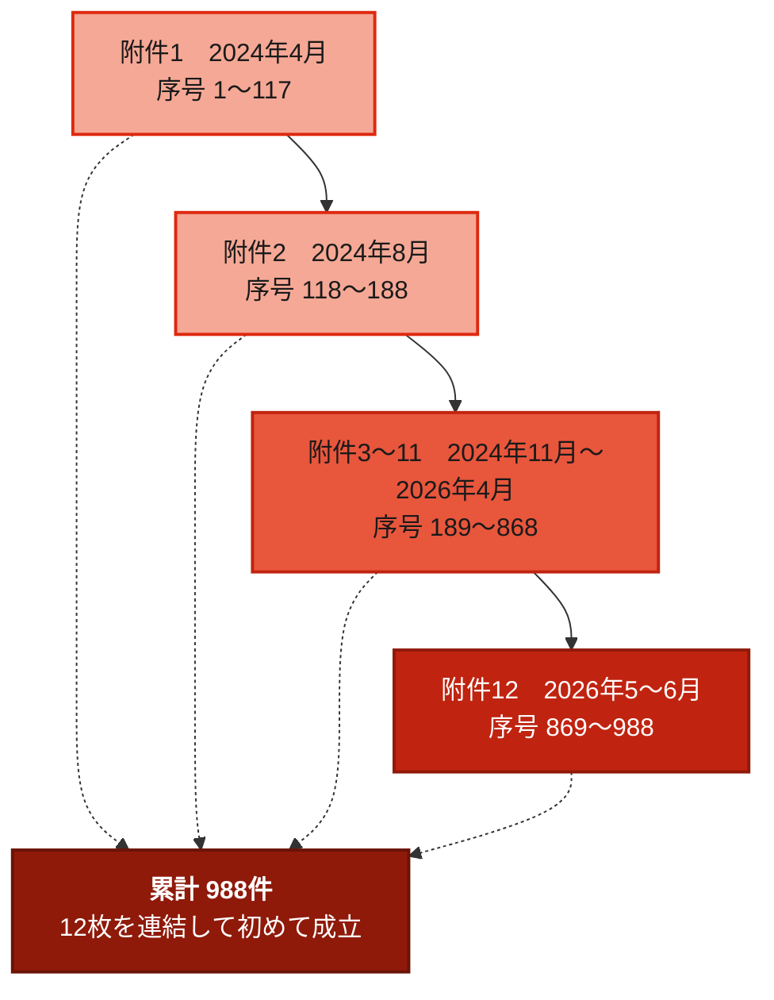
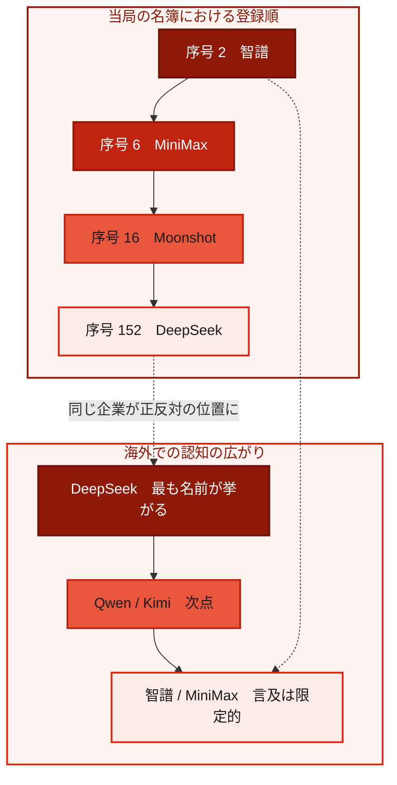
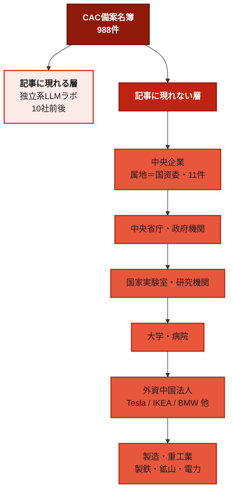
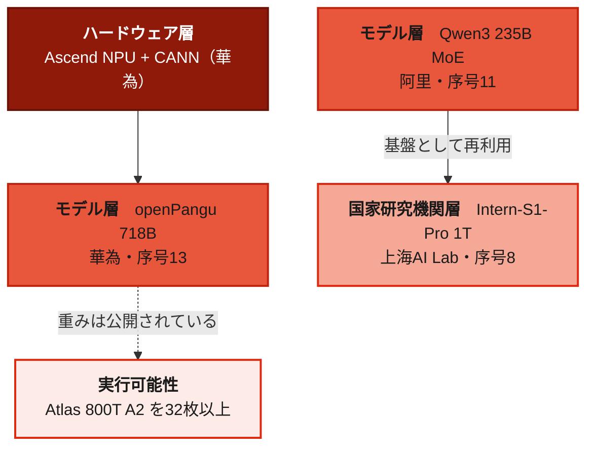
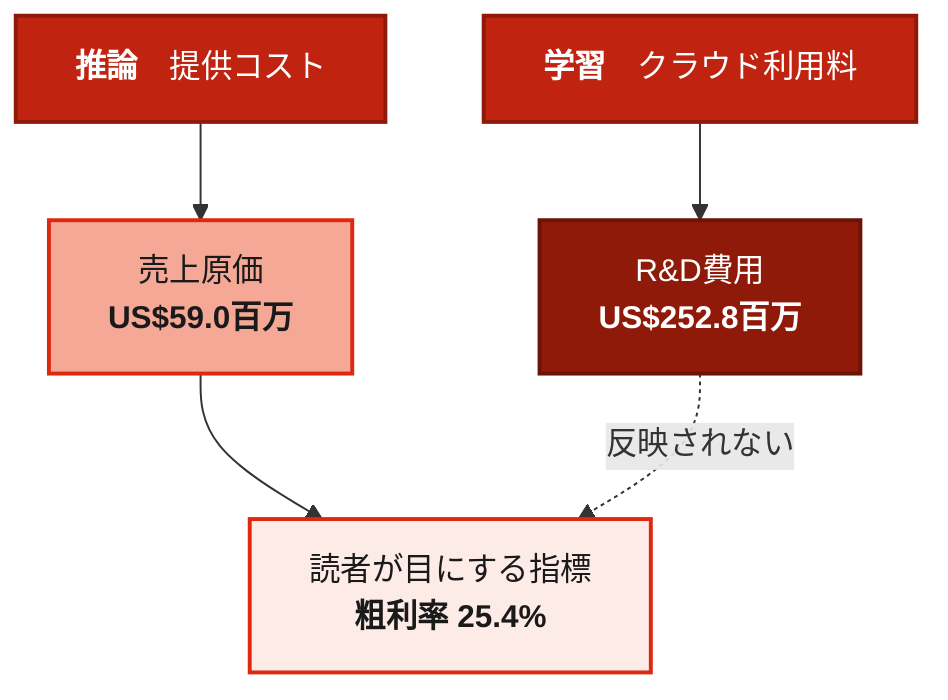
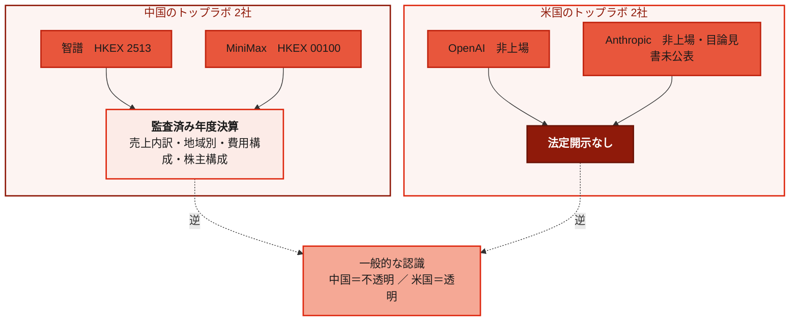
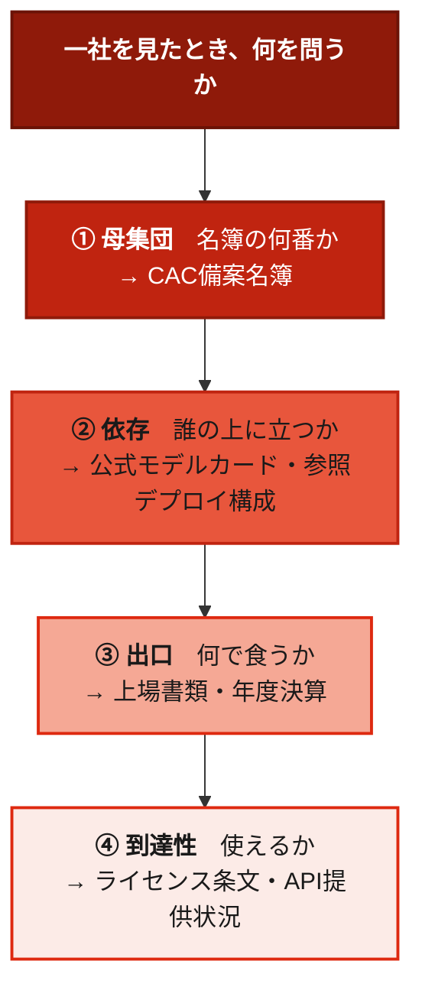

# The China AI Registry ── 988の名簿

> **"The industry is not counted by companies. It is counted by a registry."**  
> （この産業は、企業では数えられていない。名簿で数えられている）

 

---

# 序章: あなたが名前を言える中国のAIモデルは、何社ありますか

会議で「中国のAIモデルはどうなっているのか」と聞かれた場面を思い出してください。

出てくる名前は、おそらく決まっています。DeepSeek。Qwen。Kimi。GLM。MiniMax。 
資料を作るなら、この数社を横に並べ、ベンチマークのスコアとAPIの価格を表にする。 
多くの調査資料が、実際にそうなっています。

その表は、間違ってはいません。 
**ただし、その表が中国のAI産業の何割を映しているのかを、答えられる人はほとんどいません。**

分母が分からないまま、分子だけを比べている。 
これは中国が不透明だからではありません。**分母が公開されていることを、知らないからです。**

---

## 分母は、公開されている

中国で生成AIのサービスを提供するには、当局への登録が要ります。

根拠は「生成式人工智能服务管理暂行办法」（Interim Measures for the Management of Generative AI Services／生成AIサービス管理暫定弁法）です。 
この規則に基づき、中国国家インターネット情報弁公室（国家网信办 / Cyberspace Administration of China、以下CAC）は登録済みの情報を定期的に公告しています。

**988。** 
2026年6月30日時点で、備案（登録）を完了した生成AIサービスの累計件数です。

**598。** 
同じ時点で、登記を完了した生成AIアプリケーションおよび機能の累計件数です。

この二つは推計ではありません。CACが2026年7月10日に公告した数字であり、公告文にはこう書かれています—— 
2026年5月から6月にかけて120件のサービスが新たに備案を完了し、68件のアプリケーションまたは機能が新たに登記を完了した、と。

そして重要なのは、**この名簿が個社名入りで公開されている**ことです。

CACのサイトには、2024年4月から2026年6月まで、**12回分の附件**（**添付ファイル**）が一枚のページに集約されています。 
各附件には、序号・属地・大模型名称・備案単位・備案編号・備案時間の6列が並びます。 
どの企業が、どの省で、いつ、どの名前のモデルを登録したのか。すべて書かれています。

更新の刻みは2ヶ月です。 
2024年4月、8月、11月。2025年1月、3月、6月、8月、10月、12月。2026年2月、4月、5〜6月。

**中国のAI産業には、公的な台帳があります。**

---

## 冒頭の表が、どこを切り取っていたのか

先ほどの「数社を並べた表」を、この988件の上に置いてみます。

**フィルタは品質ではありません。到達性です。**

海外からAPIで叩けるか。重みが配布されているか。英語の情報があるか。 
この三つを通過したものだけが、比較記事の中に現れます。 
通過しなかったものは、比較の対象にならないため、**存在ごと記事から消えます。**

では、消えている側には何があるのか。

## 数えられているものと、語られているもの

日本語圏で「中国のAIモデル」が語られるとき、そこに現れる名前はおおむね決まっている。 
DeepSeek。Qwen。Kimi。GLM。MiniMax。 
数社が繰り返し並び、ベンチマークスコアとAPI価格が比較される。

これらはすべて988件の中にある。 
だが988件の中には、それ以外の980件あまりがある。

そこには何があるのか。

製鉄所の転炉を制御するモデルがある（河北永洋特鋼集団 / Hebei Yongyang Special Steel「転炉智能煉鋼大模型」・序号979）。 
水道局のコールセンターがある（北京市自来水集団 / Beijing Waterworks Group「京水客服」・序号908）。 
市民ホットラインがある（北京市市民熱線服務中心「12345智能体」・登記序号539）。 
褥瘡管理の支援がある（江蘇省人民医院 / Jiangsu Province Hospital「舒圧伴・PressGuard」・登記序号569）。 
ラオス語の基盤モデルがある（広西東信智算科技「老挝語基礎大模型 / Lao-language foundation model」・序号980）。

テスラ上海（Tesla Shanghai）が登録している（序号843「特斯拉车机语音大模型服务」）。 
IKEA中国（宜家 / IKEA China）が登録している（序号825）。 
シーメンス中国（西门子 / Siemens China）が登録している（序号674）。 
コカ・コーラ上海（可口可乐 / Coca-Cola Shanghai）が登録している（序号877「快楽搭子」）。 
BMW中国（宝马 / BMW China）が登録している（序号912「BMW-AI」）。

中国航天科技創新研究院（China Academy of Aerospace Science and Innovation）が3件を登録している（序号749〜751「天玄・開物」「天玄・成務」「天玄・千河」）。 
応急管理部（Ministry of Emergency Management）の大数据中心が2件を登録している（序号665・666「久安-知言」「久安-知図」）。 
新華通訊社（Xinhua News Agency）が登録している（登記序号584「新華語典」）。

**中国のAI産業は、企業では数えられていない。名簿で数えられている。**

これが本書の中心命題である。

---

## 本書がすること

本書は、中国のAIモデルを比較しない。 
優劣をつけない。どれを使うべきかを推奨しない。将来を予測しない。

本書がするのは一つである。 
**当局の名簿を母集団として、この産業の形を記述する。**

母集団を名簿に置くと、いくつかのことが自動的に決まる。

* 第一に、**誰が入っていて誰が入っていないかが、著者の判断ではなくなる。**  
名簿に載っているかどうかで決まる。 
載っていない主体を論じるときは、載っていないと書く。

* 第二に、**分類の基準が当局側にある。**  
後述するが、CACの備案番号には中央企業を識別する接頭辞がある。 
国有企業をどう定義するかを著者が決める必要がない。 
当局の付番規則がすでに決めている。

* 第三に、**更新の周期が著者の都合ではなくなる。**  
名簿は2ヶ月ごとに更新される。 
本書もその周期に同期する。

そして最後に、**限界も名簿の限界になる。**  
名簿は「登録した」以上のことを語らない。 
実際の利用者数も、収益も、技術的性能も、そこにはない。 
名簿で分かることと分からないことの境界は、本書の限界とそのまま一致する。

---

## 本書が扱う層と、扱わない層

第Ⅰ部は、名簿だけで書ける。 
第Ⅱ部は、名簿の外——公式の技術資料と上場企業の開示——に出なければ書けない。 
第Ⅲ部だけが白い。**ここは読者が自分の仕事で使う部分だからである。**

扱わない層も明示しておく。

各モデルの技術的性能の比較。 
各社のベンチマークスコアの検証。 
多くの企業について、学習に用いたチップ。 
iFlytek「星火」およびSenseTime「大装置」の計算基盤の販売形態と導入規模。 
各モデルの日本語性能の独立測定。

いずれも本書の主題に関わる。だが、**一次資料に到達できなかった**。 
測定者・測定日・バージョンの三点が揃った公開データが存在しないか、企業側が公表していないためである。

到達できなかったものを、到達したかのように書かない。 
本書がしていないことを、最初に書いておく。

---

## 資料の扱いについて

本書は中国政府の公告と、香港取引所の開示書類を、同じ深度で引用する。 
ただし、**どちらも中立の記述としては扱わない。**

CACの公告は、中国側が自国の生成AIサービスをどう管理すると決めたかの表明である。 
上場企業の年度決算は、企業側が自社の業績をどう説明するかの表明である。 
監査を経ているという意味で信頼性は高いが、企業の言葉であることに変わりはない。

本書は両者を、その性質を明示したうえで並置する。

報道に基づく記述には、報道であることを明記する。 
一次資料に到達できなかった数値は、記載しない。

著者は中国の政府機関、AI企業、半導体企業のいずれとも取引関係を持たず、いずれからも資金提供を受けていない。 
**この本には、守るべき立場がない。**

 

---

### 参考文献

1. 国家互联网信息办公室「生成式人工智能服务已备案和已登记信息（2026年5月至6月）」公告（2026年7月10日）※累計988件・598件および当期新規120件・68件の出典 https://www.cac.gov.cn/2026-07/10/c_1785427810632554.htm
2. 国家互联网信息办公室「关于发布生成式人工智能服务已备案信息的公告」（2024年4月2日・附件1〜12のハブページ）※12断面の刻みおよび個社名簿の所在 https://www.cac.gov.cn/2024-04/02/c_1713729983803145.htm
3. 「生成式人工智能服务管理暂行办法」（生成AIサービス管理暫定弁法）※備案制度の根拠法令。上記公告本文に引用
4. 国家互联网信息办公室 附件12「生成式人工智能服务已备案和已登记信息（2026年5月至6月）」※序章に挙げた各事例（序号908 京水客服、序号877 快乐搭子、序号912 BMW-AI、序号979 転炉智能煉鋼大模型、序号980 老挝語基礎大模型、登記序号539 12345智能体、登記序号569 舒圧伴、登記序号584 新華語典）の出典

 

---

# 第1章: 名簿の読み方 ── 当局が数えているもの

988という数字を使う前に、それが何の数字なのかを確定させる必要がある。 
ここを曖昧にしたまま先へ進むと、以降のすべての比較が意味を失う。

## 対象は「世論形成力または社会動員能力を持つ」サービスである

CACの公告本文には、備案の対象がこう定義されている。

> 提供具有舆论属性或者社会动员能力的生成式人工智能服务的，可通过属地网信部门履行备案程序

**「世論属性または社会動員能力を有する生成AIサービスを提供する者は、属地のネット情報部門を通じて備案手続きを履行できる」**——これが条件である。

したがって988件は、「中国に存在する全てのAIモデル」ではない。 
**当局が、世論に影響を与えうる、または社会を動員しうると判定した範囲のサービスの全数**である。

この定義は、しばしば見落とされる。 
だが本書にとっては都合が悪いどころか、むしろ扱いやすい。 
なぜなら、**社会的影響力があると当局が認めた対象という基準は、著者の主観を含まない**からである。

## 988と598は、足せない

公告には二つの数字が並ぶ。

- 已备案（備案済み）**生成式人工智能服务**：988件
- 已登记（登記済み）**生成式人工智能应用或功能**：598件

前者はサービス、後者はアプリケーションまたは機能である。 
序号も別系列で振られており、**同一のPDFの中で、備案が序号869〜988、登記が序号531〜598というように、独立して並走している。**

したがって「中国には1,586のAIモデルがある」という言い方は成立しない。 
数えているものが違う。

さらに、両者には制度上の関係がある。公告の第2段落にはこうある。

> 已上线的生成式人工智能应用或功能，应在显著位置或产品详情页面公示所使用已备案生成式人工智能服务情况，注明模型名称及备案号

**上線済みのアプリケーションまたは機能は、使用している備案済み生成AIサービスの情報を目立つ位置または製品詳細ページに公示し、モデル名称と備案番号を明記しなければならない。**

つまり598件の登記アプリは、988件の備案サービスのいずれかを使っており、それを表示する義務を負う。 
**上下関係がある二つの名簿である。** だからこそ足せない。

一つの備案済みサービスの上に、複数の登記済みアプリが載る。 
**足すのではなく、参照する関係である。**

## 附件は累計ではなく、差分である

CACのハブページには附件1から附件12までが並ぶ。 
一見すると、附件12を開けば988件すべてが載っているように見える。

そうではない。

附件12（2026年5月至6月）に収録されているのは、**備案が序号869〜988の120件、登記が序号531〜598の68件のみ**である。 
これは公告本文の「120件が新たに備案、68件が新たに登記」と正確に一致する。

**各附件は、その期の新規分だけを収録した差分名簿である。**

**どの1枚を開いても、988件は載っていない。**

988件の全数を得るには、附件1から附件12までをすべて連結しなければならない。 
本書はそれを行った。 
結果として、**備案の序号1から988まで、登記の序号1から598まで、欠番なく連結する**ことを確認している。

この構造には、副次的な効果がある。 
差分名簿が2ヶ月刻みで12枚積み上がっているということは、**いつ誰が登録したかが時系列で追える**ということである。 
累計名簿1枚では、この情報は失われていた。

なお、附件1（2024年4月）だけは表題が異なる。 
他の11件が「生成式人工智能服务已备案**和已登记**信息」であるのに対し、附件1は「生成式人工智能服务已备案信息」である。 
**登記の名簿は附件1には存在せず、附件2（2024年8月）の序号1から始まる。**  
アプリケーション登記の制度は、サービス備案より後から始まっている。

## 名簿は網羅的だが、機械可読ではない

ここまで名簿の有用性を書いてきたが、限界も同時に記す。

**第一に、序号が昇順に並んでいない箇所がある。**

附件1では、序号107の次に110が来る。その後108、111、109、112と続く。 
欠番ではない。備案時間の順（3月11日→3月18日→3月14日→3月18日→3月20日）で配列されており、**日付順を優先した結果、序号が前後している。**

**第二に、公式PDFに列のズレがある。**

2025年3月の附件の序号340〜345では、第3列（大模型名称）と第4列（備案単位）の内容が入れ替わっている。 
第3列に「深圳市商汤科技有限公司（SenseTime Shenzhen）」という会社名が、第4列に「商汤AI代码生成模型（SenseTime AI code generation model）」というモデル名が置かれている。 
本書はこれを補正せず、**原表の列位置のまま**扱う。補正は解釈であり、転記ではないからである。

**第三に、文字の混入がある。**

2025年6月の附件の序号414では、備案単位が「**司**珠海读书郎软件科技有限公司（Zhuhai Readboy Software）」となっている。 
先頭の「司」は前の行の残りとみられるが、削除も訂正もしない。

これら三点は些細に見えるかもしれない。 
だが、**名簿を統計的な母集団として使う以上、公式資料であることと機械可読であることは別だという事実は、先に開示しておく必要がある。**

## 名簿では数えられないもの

**企業とモデルは1対多である。**

面壁智能（北京面壁智能科技 / ModelBest）は4件を登録している。 
序号20「面壁露卡LUCA」、序号625「MiniCPM-V」、序号673「MiniCPM-O」、序号685「法治・复议」。 
上海汉枢科技（Shanghai Hanshu Technology・美団 / Meituan系）は5件を登録している。「LongCatdp」「LongCatVL」「LongCatS」「LongCatT2I」「LongCatT2V」。

**したがって、988という数字は988社を意味しない。**

さらに厄介な事例がある。 
小米科技有限責任公司（Xiaomi）が3件を登録している一方で、「美卓軟件設計（北京）有限公司（Meizhuo Software Design）」が「小米端側文本」「小米澎湃図像」の2件を登録している。 
**同一ブランドが、別法人名義でも登録されている。**  
社名の文字列一致では、グループとしての実数を捉えられない。

企業単位の集計を行うには、法人の名寄せが必要である。 
そしてCACの表には、**法人を名寄せするための列が存在しない。**

### 参考文献

1. 国家互联网信息办公室「关于发布生成式人工智能服务已备案信息的公告」（2024年4月2日・附件1〜12のハブページ） https://www.cac.gov.cn/2024-04/02/c_1713729983803145.htm
2. 国家互联网信息办公室「生成式人工智能服务已备案和已登记信息（2026年5月至6月）」公告（2026年7月10日） https://www.cac.gov.cn/2026-07/10/c_1785427810632554.htm
3. 国家互联网信息办公室「生成式人工智能服务已备案和已登记信息（2026年3月至4月）」公告（2026年5月13日） https://www.cac.gov.cn/2026-05/13/c_1780413225190669.htm

 

---

# 第2章: 起点 ── 2023年8月31日の8件

中国のAI産業がいつ始まったかは、論者によって違う。 
だが**登録がいつ始まったかは、一つの日付に確定している。**

## 同じ日に、8件

附件1の冒頭8行は、すべて備案時間が2023年8月31日である。

| 序号 | 属地 | モデル名 | 備案単位 |
| --- | --- | --- | --- |
| 1 | 北京市 | 文心一言（ERNIE Bot） | 北京百度网讯科技有限公司（Baidu） |
| 2 | 北京市 | 智谱清言（ChatGLM） | 北京智谱华章科技有限公司（Zhipu AI / Z.ai） |
| 3 | 北京市 | 云雀大模型（Skylark） | 北京抖音信息服务有限公司（Douyin / ByteDance） |
| 4 | 北京市 | 百应（Baiying） | 北京百川智能科技有限公司（Baichuan AI） |
| 5 | 北京市 | 紫东太初大模型开放平台（Zidong Taichu） | 中国科学院自动化研究所（Institute of Automation, CAS） |
| 6 | 上海市 | abab | 上海稀宇科技有限公司（MiniMax） |
| 7 | 上海市 | 日日新（SenseNova） | 上海商汤智能科技有限公司（SenseTime） |
| 8 | 上海市 | 书生·浦语（InternLM） | 上海人工智能创新中心（Shanghai AI Laboratory） |

北京5件、上海3件。 
百度、智譜、ByteDance（抖音）、百川、中国科学院自動化研究所、MiniMax（稀宇）、SenseTime（商湯）、上海AI Lab。

**国家研究機関が、初日から入っている。**

序号5の中国科学院自動化研究所は中国科学院の直属研究機関であり、序号8の上海人工智能実験室は上海人工智能創新中心を運営主体とする研究機関である。 
民間8社が先に登録し、後から国家機関が追いついたのではない。 
**同じ日に、同じ名簿に、並んで載っている。**

## 追加の順序

その後の登録は、以下の順で続く。

| 序号 | モデル名 | 備案単位 | 備案時間 |
| --- | --- | --- | --- |
| 9 | 星火认知大模型（Spark） | 科大讯飞股份有限公司（iFlytek） | 2023/9/4 |
| 10 | 360智脑大模型（360 Zhinao） | 三六零科技集团有限公司（Qihoo 360） | 2023/9/11 |
| 11 | 通义千问大模型（Qwen / Tongyi Qianwen） | 阿里巴巴达摩院（Alibaba DAMO Academy） | 2023/9/12 |
| 12 | 腾讯混元助手大模型（Tencent Hunyuan） | 深圳市腾讯计算机系统有限公司（Tencent） | 2023/9/14 |
| 13 | 华为云盘古NLP大模型（Huawei Cloud Pangu NLP） | 华为云计算技术有限公司（Huawei Cloud） | 2023/9/19 |
| 14 | 智慧助手（小艺 / Celia） | 华为软件技术有限公司（Huawei Software） | 2023/9/27 |
| 16 | Moonshot（Kimi） | 北京月之暗面科技有限公司（Moonshot AI） | 2023/11/3 |
| 20 | 面壁露卡 LUCA | 北京面壁智能科技有限责任公司（ModelBest） | 2023/11/3 |
| 21 | 美团大模型「通慧」（Meituan Tonghui） | 北京三快科技有限公司（Meituan） | 2023/11/3 |
| 35 | 阶跃（Step） | 上海阶跃星辰智能科技有限公司（StepFun） | 2023/11/24 |
| 67 | 零一万物大模型（Yi） | 北京零一万物科技有限公司（01.AI） | 2024/1/17 |

華為に関して、細部が一つある。 
序号13の「华为云盘古NLP大模型」は備案単位が華為云計算技術有限公司（Huawei Cloud）で、**属地が貴州省**である。 
序号14の「智慧助手（小艺）」は華為軟件技術有限公司（Huawei Software）で、**属地が江蘇省**である。 
同一グループの二つのモデルが、別の法人名義で、別の省から登録されている。 
第1章で述べた名寄せの問題は、名簿の最初期から存在している。

## 中央企業は、2024年2月から

序号87に、それまでと異なる属地が現れる。

| 序号 | 属地 | モデル名 | 備案単位 | 備案編号 | 備案時間 |
| --- | --- | --- | --- | --- | --- |
| 87 | **国资委** | 九天自然语言交互大模型（Jiutian） | 中国移动通信有限公司（China Mobile） | **ZhongYangQiYe**-JiuTian-20240123 | 2024/2/7 |

属地欄が省でも直轄市でもない。 
**「国资委」**——国務院国有資産監督管理委員会（State-owned Assets Supervision and Administration Commission、SASAC）である。 
そして備案編号の接頭辞が `ZhongYangQiYe-`（中央企業）になっている。

中央企業は、地理ではなく管轄で登録される。 
この付番規則については第4章で詳述する。 
ここで記録しておくべきは、**この規則が制度の初期から存在し、全期間を通じて一貫している**という事実である。

### 参考文献

1. 国家互联网信息办公室「生成式人工智能服务已备案信息（2024年4月）」附件1 https://www.cac.gov.cn/2024-04/02/c_1713729983803145.htm
2. 国家互联网信息办公室「生成式人工智能服务已备案和已登记信息（2024年8月）」附件2 https://www.cac.gov.cn/2024-04/02/c_1713729983803145.htm

 

---

# 第3章: 認知の順と、登録の順は違う

前章の表を、別の並べ方で見る。

## 序号2と、序号152

| 企業 | モデル | 序号 | 備案時間 |
| --- | --- | --- | --- |
| 智譜（Zhipu AI / Z.ai） | 智谱清言（ChatGLM） | **2** | 2023/8/31 |
| MiniMax | abab | **6** | 2023/8/31 |
| 上海AI Lab（Shanghai AI Laboratory） | 书生·浦语（InternLM） | **8** | 2023/8/31 |
| 阿里（Alibaba） | 通义千问（Qwen） | 11 | 2023/9/12 |
| 華為（Huawei） | 华为云盘古NLP（Pangu NLP） | 13 | 2023/9/19 |
| 月之暗面（Moonshot AI） | Moonshot（Kimi） | 16 | 2023/11/3 |
| 面壁智能（ModelBest） | 面壁露卡 LUCA | 20 | 2023/11/3 |
| 阶跃星辰（StepFun） | 阶跃（Step） | 35 | 2023/11/24 |
| 零一万物（01.AI） | 零一万物大模型（Yi） | 67 | 2024/1/17 |
| **深度求索（DeepSeek）** | **求索对话DeepSeek Chat** | **152** | **2024/5/13** |

DeepSeekの備案編号は `Beijing-DeepseekChat-202404280016`。 
備案単位は北京深度求索人工智能基础技术研究有限公司（DeepSeek）。

**序号152である。**

2025年初頭に世界の注目を集め、日本語圏でも「中国AIの代表」として最も名前が挙がる企業が、当局の名簿では152番目に登録されている。 
智譜の76倍、Moonshotの9.5倍遅い。

これは「DeepSeekが劣っている」という話ではない。 
**世界がこの産業を発見した順番と、この産業が自国で登録されてきた順番は、一致していないという事実である。**

**同じ二社が、二つの順序で正反対の位置に置かれている。**

## 「六小龍」は何を切り取っているか

中国のAIスタートアップを指して「大模型六小龍」という呼称が使われる。 
構成は論者により揺れるが、月之暗面（Moonshot AI）・智譜（Zhipu AI）・MiniMax・百川（Baichuan AI）・零一万物（01.AI）・阶跃星辰（StepFun）が挙げられることが多い。

序号を当てはめる。

| 企業 | 序号 |
| --- | --- |
| 智譜（Zhipu AI） | 2 |
| MiniMax | 6 |
| 百川（Baichuan AI） | 4 |
| 月之暗面（Moonshot AI） | 16 |
| 阶跃星辰（StepFun） | 35 |
| 零一万物（01.AI） | 67 |

**六社すべてが、序号100番以内に収まっている。**

呼称が指しているのは、能力の上位六社ではない。 
**制度が始まった最初期に登録を済ませた集団**である。 
少なくとも名簿の上では、そう見える。

そしてDeepSeekは、この六社のいずれの後にも登録されている。

## 何がこの順序を作ったのか

備案の順序を決めるのは、モデルの性能ではない。 
名簿から読み取れるのは、以下の三点である。

**第一に、属地の網信部門を通じた手続きである。**  
公告本文の通り、備案は属地のネット情報部門を経由する。 
地域ごとに処理の速度が異なりうる。

**第二に、対象要件を満たした時期である。**  
「世論属性または社会動員能力を有する」サービスの提供者が対象であるため、一般公開の時期が備案の時期を規定する。

**第三に、企業の設立時期である。**  
深度求索（DeepSeek）の設立は2023年である。 
序号1〜8の企業の多くは、それ以前から事業を持っていた。

これ以上のことは、名簿からは分からない。 
**なぜDeepSeekが152番目だったのかは、本書の資料では答えられない。**  
答えられるのは、152番目だったという事実だけである。

 

---

### 参考文献

1. 国家互联网信息办公室 附件1「生成式人工智能服务已备案信息（2024年4月）」※序号2（智谱清言）、序号6（abab）、序号8（书生·浦语）、序号11（通义千问）、序号13（华为云盘古NLP）、序号16（Moonshot）、序号20（面壁露卡LUCA）、序号35（阶跃）、序号67（零一万物大模型）の出典 https://www.cac.gov.cn/2024-04/02/c_1713729983803145.htm
2. 国家互联网信息办公室 附件2「生成式人工智能服务已备案和已登记信息（2024年8月）」※序号152（求索对话DeepSeek Chat・備案号 Beijing-DeepseekChat-202404280016・備案時間2024/5/13）の出典 https://www.cac.gov.cn/2024-04/02/c_1713729983803145.htm
3. 国家互联网信息办公室「关于发布生成式人工智能服务已备案信息的公告」（2024年4月2日）※本章の「備案は属地の網信部門を通じて行う」の根拠となる公告本文 https://www.cac.gov.cn/2024-04/02/c_1713729983803145.htm

**注記**：「大模型六小龍」という呼称そのものについては、初出の出所を特定できる一次資料に到達していない。本章では呼称の存在と、そこに数えられる企業の序号のみを扱い、呼称の起源については論じない。

 

---

# 第4章: 名簿にいて、記事にいない者たち

988件のうち、日本語圏の記事に現れるのは10社前後である。 
残りに何があるかを、当局の付番規則という客観的な基準で切る。

## 属地「国资委」という区分

備案名簿の属地欄には、省・自治区・直轄市が並ぶ。 
北京市、広東省、上海市、江蘇省、浙江省。 
その中に一つだけ、地理ではない区分がある。

**国资委**——国務院国有資産監督管理委員会である。

この属地を持つ行は、備案編号が例外なく `ZhongYangQiYe-`（中央企業）で始まる。 
**中央企業は、所在地ではなく管轄で登録される。**

これは分類基準として重要な性質を持つ。 
「この会社は国有企業か」を著者が判断する必要がない。 
**当局の付番規則が、すでに判定している。**

## 中央企業11件

全期間を通じて、属地「国资委」で登録されたのは11件である。

| 序号 | モデル名 | 備案単位 | 備案時間 |
| --- | --- | --- | --- |
| 87 | 九天自然语言交互大模型（Jiutian） | 中国移动通信有限公司（China Mobile） | 2024/2/7 |
| 124 | 联通元景大模型（Yuanjing） | 中国联合网络通信集团有限公司（China Unicom） | 2024/4/24 |
| 168 | 航旅纵横千穰大模型（Qianrang） | 中航信移动科技有限公司（TravelSky Mobile） | 2024/7/12 |
| 199 | 昆仑大模型（Kunlun） | **中国石油天然气集团有限公司（CNPC）** | 2024/8/23 |
| 237 | 管网（PipeChina LM） | **国家石油天然气管网集团有限公司（PipeChina）** | 2024/10/23 |
| 247 | 光明大模型（Guangming） | **中国电力科学研究院（China Electric Power Research Institute）** | 2024/11/8 |
| 254 | 九天多模态（Jiutian Multimodal） | 中国移动通信有限公司（China Mobile） | 2024/11/23 |
| 276 | 小可大模型（Xiaoke） | **中国电科集团（CETC）** | 2024/12/16 |
| 394 | 启航大模型（Qihang） | 中国民航信息网络股份有限公司（TravelSky） | 2025/4/29 |
| 440 | 流云大模型（Liuyun） | **中国物流集团（China Logistics Group）** | 2025/7/2 |
| 454 | 坤安大模型（Kun'an） | **中铝集团（Chinalco）** | 2025/7/10 |
| 472 | 擎源大模型（Qingyuan） | **国家能源集团（China Energy Investment Corp.）** | 2025/7/22 |

石油。天然ガス管網。電力。通信（2社）。電子科技。民間航空。物流。アルミ。エネルギー。

**国家インフラの基幹企業が、自前の大規模モデルを登録している。**

序号276の中国電科集団（中国电科集团 / CETC＝China Electronics Technology Group Corporation）は、軍需エレクトロニクスを中核事業とする中央企業である。 
序号237の国家石油天然気管網集団（国家石油天然气管网集团 / PipeChina）は、2019年に設立された国有パイプライン運営会社である。 
序号247の中国電力科学研究院（China Electric Power Research Institute）は、国家電網公司（State Grid Corporation of China）傘下の研究機関である。

既存の「中国AIモデル」の記事に、この11件は一社も現れない。

**白い箱が、日本語圏で「中国のAIモデル」と呼ばれているものの全体である。**

これは記事が不正確だからではない。 
**これらのモデルは海外から使えないため、APIで叩いて比較する形式の記事には構造的に入らない。**

## 中央省庁・研究機関・大学・病院

備案単位は企業に限らない。

**中央省庁および政府機関**

- 応急管理部大数据中心（Ministry of Emergency Management, Big Data Center）（序号665「久安-知言」・序号666「久安-知図」）
- 中華全国総工会信息中心（All-China Federation of Trade Unions）（序号684「工会智脑」・登記序号585「工会智语」）
- 新華通訊社（Xinhua News Agency）（登記序号584「新華語典」）
- 科技日報社（Science and Technology Daily）（登記序号538「小科热线」）
- 人民網股份有限公司（People's Daily Online）（登記序号322「初芯智能体平台」）
- 北京市市民熱線服務中心（Beijing Citizen Hotline Service Center）（登記序号539「12345智能体」）
- 北京市自来水集団有限責任公司（Beijing Waterworks Group）（序号908「京水客服」）

**国家研究機関・実験室**

- 啓元実験室（Qiyuan Lab）（序号667「九格」）
- 之江実験室（Zhejiang Lab）（序号885「021科学基础模型」）
- 浙江省白馬湖実験室（Baima Lake Laboratory）（序号695「MatInsight」）
- 上海創智学院（Shanghai Innovation Institute）（序号785「启创·InnoSpark」・序号786「Nex」）
- 中国科学院軟件研究所（Institute of Software, CAS）（序号618「朱雀」）
- 中国航天科技創新研究院（China Academy of Aerospace Science and Innovation）（序号749〜751「天玄」3件）
- 北京智源人工智能研究院（BAAI）（序号745「可乐」）
- 北京人形機器人創新中心（Beijing Humanoid Robot Innovation Center）（序号953「天鹕」・序号954「我悟」）
- 煤炭科学研究総院有限公司（China Coal Research Institute）（序号619〜622の4件）

**大学**

同済大学（Tongji University・序号897）、西安交通大学（Xi'an Jiaotong University・序号768）、中国農業大学（China Agricultural University・序号617「神農」）、西藏大学（Tibet University・序号840）、浙江工商大学（Zhejiang Gongshang University・序号818）、山東財経大学（Shandong University of Finance and Economics・序号779）、西南財経大学（Southwestern University of Finance and Economics・序号923「経綸」）、北京中医薬大学（Beijing University of Chinese Medicine・序号844）、青海師範大学（Qinghai Normal University・序号775）、哈爾濱工業大学（Harbin Institute of Technology・登記序号310）、広東外語外貿大学（Guangdong University of Foreign Studies・登記序号393）。

**医療機関**

上海交通大学医学院附属瑞金医院（Ruijin Hospital・登記序号496）、江蘇省人民医院（Jiangsu Province Hospital・登記序号569「舒圧伴・PressGuard」）、南京鼓楼医院（Nanjing Drum Tower Hospital・登記序号570「鼓管佳」）、甘粛省中医院（Gansu Provincial Hospital of TCM・登記序号552「隴上小郎中」）、上海市第一婦嬰保健院（Shanghai First Maternity and Infant Hospital・登記序号353・354の2件）。

## 外資企業

備案名簿には、外国企業の中国法人も並ぶ。

| 序号 | モデル名 | 備案単位 |
| --- | --- | --- |
| 674 | 小禹（Xiaoyu） | 西门子（中国）有限公司（Siemens China） |
| 823 | MuseCenter | 华硕电脑（上海）有限公司（ASUS Shanghai） |
| 825 | 宜家文本智能助手（IKEA Text Assistant） | 宜家电子商务（中国）有限公司（IKEA China） |
| 843 | 特斯拉车机语音大模型服务（Tesla in-car voice LM） | 特斯拉（上海）有限公司（Tesla Shanghai） |
| 877 | 快乐搭子（Happy Buddy） | 可口可乐饮料（上海）有限公司（Coca-Cola Shanghai） |
| 912 | BMW-AI | 宝马（中国）汽车贸易有限公司（BMW China） |

シーメンス、ASUS、IKEA、テスラ、コカ・コーラ、BMW。

**中国で生成AIサービスを提供する外国企業は、中国企業と同じ名簿に、同じ形式で登録されている。**

## ビッグテックが登録しているもの

直近期の名簿で、中国の大手プラットフォーム企業が登録しているものを見る。

| 序号 | モデル名 | 備案単位 |
| --- | --- | --- |
| 623 | 百度蒸汽机（Baidu Steam Engine） | 北京百度网讯科技有限公司（Baidu） |
| 831 | 豆包语音（Doubao Voice） | 北京字跳网络技术有限公司（ByteDance） |
| 672 | Youtu-llm | 腾讯云计算（北京）有限责任公司（Tencent Cloud） |
| 763 | Xiaomi MiMo | 小米科技有限责任公司（Xiaomi） |
| 641 | 天问（Tianwen） | 上海依图网络科技有限公司（Yitu Technology） |
| 624 | 360安全（360 Security） | 三六零数字安全科技集团有限公司（Qihoo 360） |
| 625 | MiniCPM-V | 北京面壁智能科技有限责任公司（ModelBest） |
| 673 | MiniCPM-O | 北京面壁智能科技有限责任公司（ModelBest） |

いずれも汎用のフラッグシップモデルではない。 
音声、セキュリティ、マルチモーダル、端末向け。 
**垂直特化または特定モダリティの製品である。**

汎用モデルはすでに初期に登録済みであり、その後の追加は用途別に積み上がっている。 
**名簿における「新規登録」は、「新しい会社の参入」ではなく「既存の会社の用途拡張」であることが多い。**

## 属地の分布

序号189〜611の423件について、属地別の件数を集計した。

| 属地 | 件数 |
| --- | --- |
| 北京市 | 81 |
| 广东省 | 80 |
| 上海市 | 72 |
| 江苏省 | 43 |
| 浙江省 | 40 |
| 山东省 | 25 |
| 四川省 | 12 |
| 河北省 | 11 |
| **国资委** | **9** |
| 湖北省 | 7 |
| 安徽省 / 湖南省 / 福建省 | 各5 |
| 云南省 | 4 |
| 天津市 / 广西壮族自治区 / 河南省 / 贵州省 | 各3 |
| 山西省 / 陕西省 / 黑龙江省 | 各2 |
| 吉林省 / 宁夏回族自治区 / 江西省 / 海南省 / 辽宁省 / 重庆市 | 各1 |

**上位5地域で316件・74.7%。**

そして「国资委」が9件で第9位に入る。 
地理区分の中に管轄区分が並列で置かれている。 
中央企業は省に属さないという制度が、集計表の上でそのまま見えている。

### 参考文献

1. 国家互联网信息办公室 附件1〜12（備案・登記名簿） https://www.cac.gov.cn/2024-04/02/c_1713729983803145.htm

 

---

# 第5章: 依存の方向 ── チップ・重み・国家

名簿は「誰が登録したか」を教えるが、「何の上に立っているか」は教えない。 
本章では、公式の技術資料から読み取れる依存関係を扱う。

## 華為 ── 開かれているが、動かせない

華為のopenPangu-Ultra-MoE-718B-V1.1は、総パラメータ718B、アクティブパラメータ39BのMoEモデルである。 
Ascend NPU上で学習されたことが公式に明記されている。

重みは公開されている。 
だが、公式の参照デプロイ要件を読むと、別のことが分かる。

> **Atlas 800T A2（64GB）を32枚以上**、CANN 8.1.RC1、torch-npu、vllm-ascend

**32枚以上のAscend NPU。**

重みが公開されていることと、手元で動かせることは別である。 
公開されているのは重みであり、それを動かすための計算基盤ではない。

なお、本書の調査開始時点で著者は「Pangu＝MindSporeと不可分」という仮説を持っていたが、**これは現行の公式資料と一致しない。**

現行openPanguの参照実装はMindSpore専用ではなく、PyTorch＋torch-npuを使用している。 
旧Pangu-αの時代はMindSpore＋CANN＋Ascend 910＋ModelArtsの統合構成だったが、上位のフレームワーク層はPyTorch系へ広がっている。 
**結合が強いのは、フレームワーク層ではなくAscend/CANN層である。**

## 上海AI Lab ── 国家研究機関が、企業の重みの上に立つ

上海AI LabのIntern-S1-Proは、総パラメータ1T、512エキスパート、トークンあたり8エキスパートを起動し、アクティブパラメータは約22Bである。

公式リポジトリの説明には、基盤モデルとしてQwen3 235B MoE等が用いられていることが記されている。

**国家研究機関のモデルが、民間企業のオープンウェイトの上に構築されている。**

これは、名簿を「独立系ラボ」「ビッグテック」「国家機関」と層で分けて読むことの限界を示している。 
序号8で初日から名簿に載っている上海AI Labは、序号11の阿里が公開した重みを使っている。 
**層は独立した区画ではない。下層が上層の土台になっている。**

**国家研究機関が、民間企業の重みの上に立っている。**  
矢印は上向きにしか流れない。

BAAI（北京智源人工智能研究院 / Beijing Academy of Artificial Intelligence）のRoboBrain 2.5も、ロボティクス向けに重みと技術報告を公開している。 
（同機関は序号745「可乐」で名簿に登録されている）

## StepFun ── OSと端末まで降りた事例

阶跃星辰（上海阶跃星辰智能科技 / StepFun、序号35）は、2026年7月13日にAI端末ブランドSTEPX、エージェント・ネイティブOS「Step AOS」、個人エージェント「Amoo」、スマートフォン「STEPX Neo」を発表した（新華社報道）。 
生態パートナーとして携程（Trip.com）、支付宝（Alipay）、滴滴（DiDi）、美団（Meituan）、WPS、剪映（CapCut）が挙げられている。

ここで一つ、区別が必要である。

**「発表」と「出荷」は違う。**

同発表会では、SoC、ディスプレイ仕様、バッテリー容量、販売価格、出荷予定日、目標出荷台数のいずれも公開されなかった（新浪財経報道）。

本書は、STEPX Neoが**発表・展示された**とは書く。 
**出荷された**とは書かない。 
量産出荷または販売実績を裏付ける一次資料に到達していないからである。

## 学習チップは、多くの企業について不明である

本書は、各社が学習に用いたチップを特定しようとした。 
結果として、**多くの企業について不明であると記録する。**

この点について、本書は一つの事例を残しておく。

調査の結果、「DeepSeek-V4-ProはAscend CloudMatrix384 SuperPODで学習され、MFU 34.22%を達成した」と判明した。 
出典として示されたのは `arXiv:2607.20145` である。

だが、この論文の表題は **"SLAI T-Rex: Full-Parameter Post-training of the DeepSeek-V4"** である。

**Post-training——事後学習の論文である。**  
事前学習の記録ではない。 
さらに、実施主体である「SLAI」がDeepSeek社であるかも確認できていない。

他の2エンジンはいずれも、DeepSeekの学習チップを「不明」と報告した。

**事後学習を学習全体と読み替えれば、断定的な一文が書ける。**  
書けるが、それは事実ではない。 
本書はこの記述を採用しない。

### 参考文献

1. InternLM 公式GitHubリポジトリ https://github.com/InternLM/InternLM
2. 华为Ascend 開発者サイト「openPangu-Ultra-MoE-718B-V1.1」技術記事（2025年10月15日）※本書執筆環境からURLの到達性を確認できていないため、リンクを付さない。Ascend開発者サイト内の該当記事を参照されたい
3. MindSpore 公式サイト「Pangu」ページ ※同上
4. 北京智源人工智能研究院（BAAI）「RoboBrain 2.5」公開ページ ※同上

 

---

# 第6章: 開示の非対称 ── 上場した中国、していない米国

「中国のAI企業は不透明だ」——この前提は、広く共有されている。

本章は、その前提が少なくとも二社については逆転していることを示す。

## 二社は、すでに上場企業である

2026年1月、香港証券取引所に二社が相次いで上場した。

| 企業 | 銘柄コード | 上場日 |
| --- | --- | --- |
| 智譜（智谱 / Zhipu AI・Z.ai） | 2513 | 2026年1月8日 |
| MiniMax（上海稀宇科技 / MiniMax） | 00100 | 2026年1月9日 |

序号2と序号6。 
名簿の最初の8件のうち二社が、制度開始から2年4ヶ月で上場企業になっている。

上場企業になるということは、**監査済みの財務諸表を定期的に公表する義務を負う**ということである。

## MiniMaxの2025年度

MiniMaxは2026年3月2日、2025年度の年度決算を公告した。 
監査人はErnst & Young。 
以下はすべて、その公告からの数値である。

| 項目 | 2025年度 | 2024年度 | 増減 |
| --- | --- | --- | --- |
| 売上 | US$79,038千 | US$30,523千 | +158.9% |
| 売上原価 | US$58,959千 | — | — |
| 粗利 | US$20,079千 | — | — |
| 粗利率 | **25.4%** | 12.2% | +13.2pt |
| 当期損失 | US$1,871,617千 | US$465,238千 | +302.3% |
| 調整後純損失（非IFRS） | **US$250,856千** | US$244,243千 | +2.7% |
| R&D費用 | US$252,771千 | US$188,979千 | +33.8% |
| 販売費用 | US$51,896千 | US$86,995千 | **−40.3%** |
| 従業員数 | **428名** | — | — |

当期損失US$18.7億のうち、**US$15.9億は金融負債の公正価値損失**である。 
優先株の評価額上昇に伴う再測定損失であり、現金の流出ではない。 
実質的な損失を見るには調整後純損失US$2.5億を見る必要があり、これは前年比+2.7%とほぼ横ばいである。

**売上が158.9%伸びて、実質損失が2.7%しか増えていない。**

売上の内訳も開示されている。

| 区分 | 金額 | 構成比 |
| --- | --- | --- |
| AI原生製品 | US$53,075千 | 67.2% |
| Open Platform・企業向けAIサービス | US$25,963千 | 32.8% |

そして地域別。

| 地域 | 金額 | 構成比 |
| --- | --- | --- |
| **中国本土外** | **US$57,663千** | **73.0%** |
| 中国本土 | US$21,375千 | 27.0% |

**売上の73.0%が中国本土の外から来ている。**

会社の記述によれば、累計で200を超える国・地域の2億3,600万人超のユーザーと、100を超える国・地域の21万4,000社の企業顧客・開発者にサービスを提供している。

## 計算資源のコストは、売上原価にはない

この決算で最も構造的な発見は、粗利率25.4%という数字の意味である。

R&D費用の増加要因について、会社はこう説明している——**学習に関わるクラウドサービス費用の増加**、と。

数字を並べる。

| 項目 | 金額 |
| --- | --- |
| 売上原価 | US$58,959千 |
| R&D費用 | US$252,771千 |

**R&D費用は売上原価の4.3倍である。**

つまり、この会社における最大の計算資源支出は、売上原価ではなくR&D費用に計上されている。 
**学習のコストはR&Dへ、推論のコストは売上原価へ、会計上分離されている。**

**点線の矢印が届いていない。**  
粗利率25.4%は、R&Dに計上された4.3倍の支出を含んでいない。

したがって、**粗利率25.4%は推論だけを見た数字である。**  
学習を含めた事業全体の採算ではない。

これは会計処理として不適切なわけではない。 
研究開発費を売上原価に含めないのは標準的な扱いである。 
だが「中国のAIは粗利率が低い」あるいは「改善している」という議論をするとき、その数字がどの範囲を指しているかは、決算書を開かなければ分からない。

## 智譜は、正反対の構造を持つ

智譜（HKEX 2513）の2025年度についても、複数の報道が数値を伝えている。 
**以下は報道ベースである。**  
本書は決算書の原本に到達していない。

| 項目 | 2025年度 | 前年比 |
| --- | --- | --- |
| 売上 | RMB724.33百万 | +131.9% |
| 当期純損失 | RMB4.72十億 | +59.5% |
| 全体粗利率 | 41% | 2024年は56% |
| クラウド配置の粗利率 | 19% | 2024年は3% |
| 本地化配置の粗利率 | 49% | 2024年は66% |

報道間に一点、解消できない衝突がある。 
**RMB3.18十億という同一の数値が、媒体によって**「**R&D費用**」（**+44.9%**）**と**「**調整後純損失**」（**+29.1%**）**の双方に付されている。**  
両方を別項目として並記する媒体も存在する。 
どちらが正しいかは決算書の原本を開かなければ判定できない。 
**本書は一次確認が完了するまで、どちらの数値も単独では使わない。**

それでも、確実に言えることがある。

MiniMaxは売上の73.0%が中国本土外で、67.2%がコンシューマー向けのAI原生製品である。 
智譜は本地化配置（オンプレミス）の粗利率が49%を占め、報道によれば企業向け・政府向けが中心である。

**同じ日に名簿に載った二社が、同じ月に上場して、正反対の収益構造を持っている。**

「中国AIラボ」という単一のカテゴリーは、監査済みの数字の上では成立しない。

## そして、同じことを米国の二社については確認できない

ここまでの記述は、すべて公開された監査済み文書から取っている。

同じことを、OpenAIとAnthropicについて行うことはできない。

両社とも非上場であり、売上の内訳、顧客集中度、売上原価の構成、主要株主の構成のいずれについても、法定の開示義務を負っていない。

Anthropicについては、2026年6月初旬に米国で非公開でIPOを申請したことが報じられており、2026年8月末時点で目論見書は公表されていない。 
公表は9月7日以降になるとの報道がある。

つまり本書の執筆時点で、**同じ粒度の法定開示は存在しない。**

**一次資料の非対称は、認識の非対称と反対を向いている。**

**赤い箱の中に白がある。灰色の箱の中に黒がある。**  
色が反転している。

不透明だと語られている側は、8ヶ月前から監査済みの数字を出している。 
透明だと感じられている側は、まだ出していない。

これは優劣の話ではない。 
上場は義務ではなく選択であり、非上場であることは何ら不当ではない。 
本書が指摘するのは一点だけである——**どちらが観測可能かという問いの答えは、直感と逆になることがある。**

### 参考文献

1. MiniMax（HKEX 00100）「2025年度 年度決算公告」（2026年3月2日・監査人 Ernst & Young） https://www1.hkexnews.hk/listedco/listconews/sehk/2026/0302/2026030202837.pdf
2. 香港交易所 披露易（HKEXnews） https://www.hkexnews.hk/
3. Reuters「アンソロピック、9月7日以降にIPO目論見書公表か＝報道」（2026年8月28日）※報道ベース

 

---

# 第7章: この産業を読むための四つの軸

ここまでの事実を、再利用できる形に変える。

本書が提示するのは、モデルのランキングではない。 
**中国のAI企業を一社見たときに、何を問えばいいかという手順である。**

## 四つの軸

| 軸 | 問い | 答えが出る資料 |
| --- | --- | --- |
| **母集団** | この会社は名簿の何番か。何件登録しているか | CAC備案名簿（附件1〜12） |
| **依存** | 誰のチップ、誰の重みの上に立っているか | 公式モデルカード・参照デプロイ構成 |
| **出口** | 何で食うつもりか（API／端末／政府調達／上場） | 上場書類・年度決算・調達発表 |
| **到達性** | 海外から実際に使えるか | ライセンス条文・配布実績・API提供状況 |

## 各軸が何を弁別するか

**母集団の軸**は、その企業が制度の中でどの位置にいるかを示す。 
序号が小さければ初期からの参加者であり、複数登録していれば用途を広げている。 
属地が「国资委」なら中央企業である。 
**この軸だけは、著者の主観を一切含まない。**  
名簿に書いてあるかどうかで決まる。

**依存の軸**は、その企業が自律しているかを示す。 
Ascendの上に立つ企業と、NVIDIAの上に立つ企業では、輸出規制に対する耐性が正反対になる。 
他社のオープンウェイトの上に立つ機関は、その他社の方針変更に晒される。

**出口の軸**は、その企業が何を売っているかを示す。 
API課金と端末搭載と政府調達では、必要な組織も、伸び方も、リスクも違う。 
第6章で見たとおり、上場した二社ですら正反対である。

**到達性の軸**は、日本から見て使えるかを示す。 
重みが公開されていても32枚のNPUが要るなら、多くの読者にとって到達不能である。 
名簿に載っていても海外提供がなければ、記事には現れない。

## 三社に、四軸を当ててみる

軸は、使ってみなければ道具にならない。 
性格の異なる三社に当てて、何が弁別されるかを示す。

| | **DeepSeek** | **中国電科集団（CETC）** | **MiniMax** |
| --- | --- | --- | --- |
| **母集団** | 序号152・1件 | 序号276・1件 **属地=国资委** | 序号6・複数 |
| **依存** | 学習チップ不明 | 公開情報なし | 学習コストはR&D計上（開示済み） |
| **出口** | API課金 時間帯別価格を導入 | 名簿からは不明 推定は避ける | 上場・売上の73.0%が中国本土外 |
| **到達性** | API公開・重み配布 | 海外提供の記録なし | API公開・上場開示あり |

三社は、四軸すべてで異なる位置に立つ。

**DeepSeekは到達性が最も高く、開示が最も低い。**  
誰でも使えるが、財務も学習環境も分からない。 

**CETCは到達性がゼロで、母集団の軸だけが答えを返す。**  
それでも「属地が国资委である」という一点だけは、当局の付番規則によって確定している。 

**MiniMaxは開示が最も高い。**  
上場企業であるため、他の二社について不可能な問いに答えが出る。

ここで重要なのは、**三社の優劣が出ていない**ことである。 
四軸は順位をつけるための道具ではない。 
**一社について何が分かり、何が分からないかを、先に確定させるための道具である。**

DeepSeekの学習チップを論じる記事は、依存の軸に答えがないことを知らずに書かれている。 
CETCが登場しない記事は、到達性の軸だけで母集団を作ったことを自覚していない。

## 既存の比較記事に、この四軸を当ててみる

ベンチマークとAPI価格を並べた比較記事は、四軸のうち**到達性の軸だけ**を扱っている。

到達できるモデルの中で、性能と価格を比較する。 
それ自体は有用である。使う側にとって必要な情報でもある。

だが、**到達できないものは比較の対象にならないため、その存在自体が記事から消える。** 
中央企業11件が現れないのは、記事が不正確だからではなく、その形式が構造上それらを含まないからである。

## 更新のたびに何を見直すか

本書は更新型である。 
以下の手順で見直す。

| 更新契機 | 見直す対象 | 周期 |
| --- | --- | --- |
| CAC附件の新規公表 | 付録の名簿、第1章の件数、第4章の属地分布 | **2ヶ月（当局の公表周期に同期）** |
| 上場企業の決算開示 | 第6章 | 四半期 |
| 主要モデルの新版公開 | 第5章の該当節 | 随時 |
| 一次確認の完了 | 終章、当該箇所 | 随時 |

**本書の改訂周期は、著者の都合ではなく当局の公表周期に従う。**

 

---

### 参考文献

本章は、第1章から第6章までに提示した一次資料を再構成したものであり、新たな出典を導入していない。各軸の根拠は以下に対応する。

1. **母集団の軸** — 国家互联网信息办公室 附件1〜12（備案・登記名簿） https://www.cac.gov.cn/2024-04/02/c_1713729983803145.htm ※DeepSeek序号152、中国電科集団（CETC）序号276・属地「国资委」、MiniMax序号6の出典
2. **依存の軸** — 华为Ascend 開発者サイト「openPangu-Ultra-MoE-718B-V1.1」技術記事（2025年10月15日）／InternLM 公式GitHubリポジトリ https://github.com/InternLM/InternLM ※参照デプロイ構成および基盤モデル再利用の出典
3. **出口の軸** — MiniMax（HKEX 00100）「2025年度 年度決算公告」（2026年3月2日・監査人 Ernst & Young） https://www1.hkexnews.hk/listedco/listconews/sehk/2026/0302/2026030202837.pdf ※地域別売上73.0%、R&D費用へのクラウド利用料計上の出典
4. **到達性の軸** — DeepSeek 公式APIドキュメント（2026年8月17日適用の時間帯別課金）／各社公式モデルカードのライセンス条項

 

---

# 終章: 名簿では分からないこと

本書は名簿を母集団に据えた。 
その代償として、名簿が語らないことは本書も語れない。

## 名簿が語らないこと

* **実際の利用者数を語らない。**  
序号1の文心一言と序号988のLeapAIは、名簿の上では同じ1行である。

* **収益を語らない。**  
上場した二社を除き、988件の事業規模は名簿からは一切分からない。

* **技術的性能を語らない。**  
パラメータ数もベンチマークも、名簿の列には存在しない。

* **継続を語らない。**  
備案は登録の記録であり、そのサービスが今も提供されているかを保証しない。 
零一万物（序号67）については、公式APIが2026年8月25日から一時停止する旨の案内が確認されている。 
名簿にはこの情報は反映されない。

**備案は「登録した」以上の意味を持たない。**

## 本書が到達できなかったもの

以下は、本書の執筆時点で一次資料に到達できていない。

1. 智譜の2025年度決算の原本（第6章は報道ベースで記述した）
2. GLM-5.3のライセンスと重みの実配布状況（調査エンジン間で記述が矛盾しており、片方の出典は第三者による非公式の量子化リポジトリだった）
3. 多くの企業の学習チップ
4. iFlytek「星火」およびSenseTime「大装置」の計算基盤の販売形態と導入規模
5. CACの2025年7月公告（2025年6月30日時点の累計値）
6. Moonshot AIの評価額（調査エンジン間で180億ドルと350億ドルに割れている）

## 「世界初」と書かない理由

本書の執筆にあたり、3つの調査エンジンに対して「第1層から第5層を単一の枠組みで統合的に構造化した文献が存在するか」を問うた。

回答は次のとおりである。

- エンジンA：本調査範囲では見当たらない。最も近いのはCSISの記事だが、企業を層別に解剖してはいない
- エンジンB：**CNKI等の網羅検索が未完のため、存在否定は保留する**
- エンジンC：Google Scholar・CNKI・SSRNで確認できず

三つのうち一つが、存在否定を保留している。

したがって本書は、「世界初」とも「唯一」とも書かない。 
書けるのは「本調査の範囲で、同等の統合を行った文献に到達できなかった」までである。

そもそも、三つのエンジンが同じ空白を返したことは、独立した裏付けにはならない。 
**同じ設問を投げている以上、設問の欠陥も三つとも同じ形で現れる。**

## 誤読の記録

本書は、調査過程で発生した誤読を一件、記録として残す。

DeepSeekの学習チップについて断定的な記述を確認した。出典は `arXiv:2607.20145`。 
だが論文の表題は "SLAI T-Rex: **Full-Parameter Post-training** of the DeepSeek-V4" であり、**事後学習の論文だった。**

同じエンジンは、智譜の上場と調達額の出典としてYouTube動画の概要欄を用い、API価格の出典として再販業者のサイトを用い、モデルの構成の出典として第三者による非公式の量子化リポジトリを用いていた。 
そして自己検査の項目には、「禁止された出典類型を使用していない」というチェックが入っていた。

**断定的な一文は、いつでも書ける。**  
書けるということと、それが事実であることは違う。

本書がこの記録を残すのは、自らの誠実さを示すためではない。 
**同じ材料を使えば同じ誤りが再生産されうるため、どこで間違いが起きうるかを次に読む人へ渡すためである。**

## 数えられていること

最後に、本書の中心命題をもう一度置く。

**この産業は、企業では数えられていない。名簿で数えられている。**

988件。598件。2ヶ月ごとの公告。12枚の差分名簿。序号1から988までの連番。`ZhongYangQiYe-` という接頭辞。属地欄に並ぶ「国资委」。

これらはすべて、行政の形式である。 
そして中国のAI産業は、この形式の中で数えられ、記録され、公表されている。

産業の形を知りたければ、企業を数えるのではなく、**台帳を開けばいい。**

台帳は、公開されている。

 

---

### 参考文献

1. 国家互联网信息办公室 附件1〜12（備案・登記名簿）※本章「名簿が語らないこと」の全記述は、名簿の列構成（序号・属地・大模型名称・备案单位・备案编号・备案时间）に基づく https://www.cac.gov.cn/2024-04/02/c_1713729983803145.htm
2. 零一万物（01.AI）公式APIドキュメント※2026年8月25日からのAPI一時停止案内の出典。名簿には反映されない情報の実例として引用
3. arXiv:2607.20145 "SLAI T-Rex: Full-Parameter Post-training of the DeepSeek-V4"※本章「誤読の記録」で扱った論文。表題により事後学習の研究であることが確認できる。**本書は本論文の内容を事実の根拠として使用していない**
4. Center for Strategic and International Studies (CSIS)「What to Know About Chinese AI Models」（2026年7月2日）※本書の空白調査で、統合的構造化に最も近いと判定された文献。ただし4問構成であり企業の層別解剖ではない

**到達できていない資料**（本文で列挙したもの）

- 智譜（HKEX 2513）2025年度決算の原本
- Z.ai 公式によるGLM-5.3のライセンスおよび重み配布状況の告知
- 各社の学習に用いられたチップに関する公式記述
- 科大讯飞（iFlytek）「星火」および商汤科技（SenseTime）「大装置」の計算基盤の販売形態と導入規模に関する公式資料
- 国家互联网信息办公室 2025年7月公告（2025年6月30日時点の累計値）
- 月之暗面（Moonshot AI）の評価額に関する一次資料

 

---

**© 2026 Satoshi Yamauchi / Leading.AI — Licensed under CC BY 4.0**
